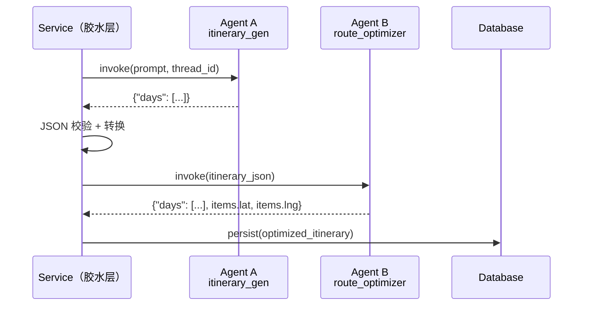
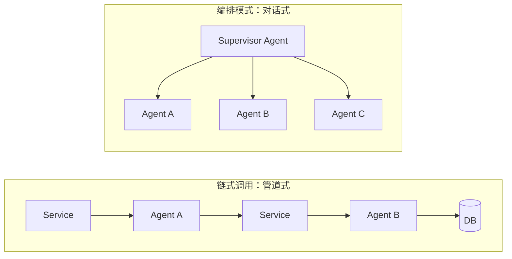
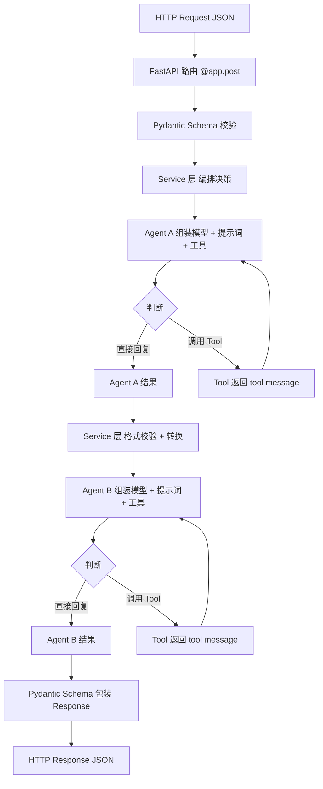
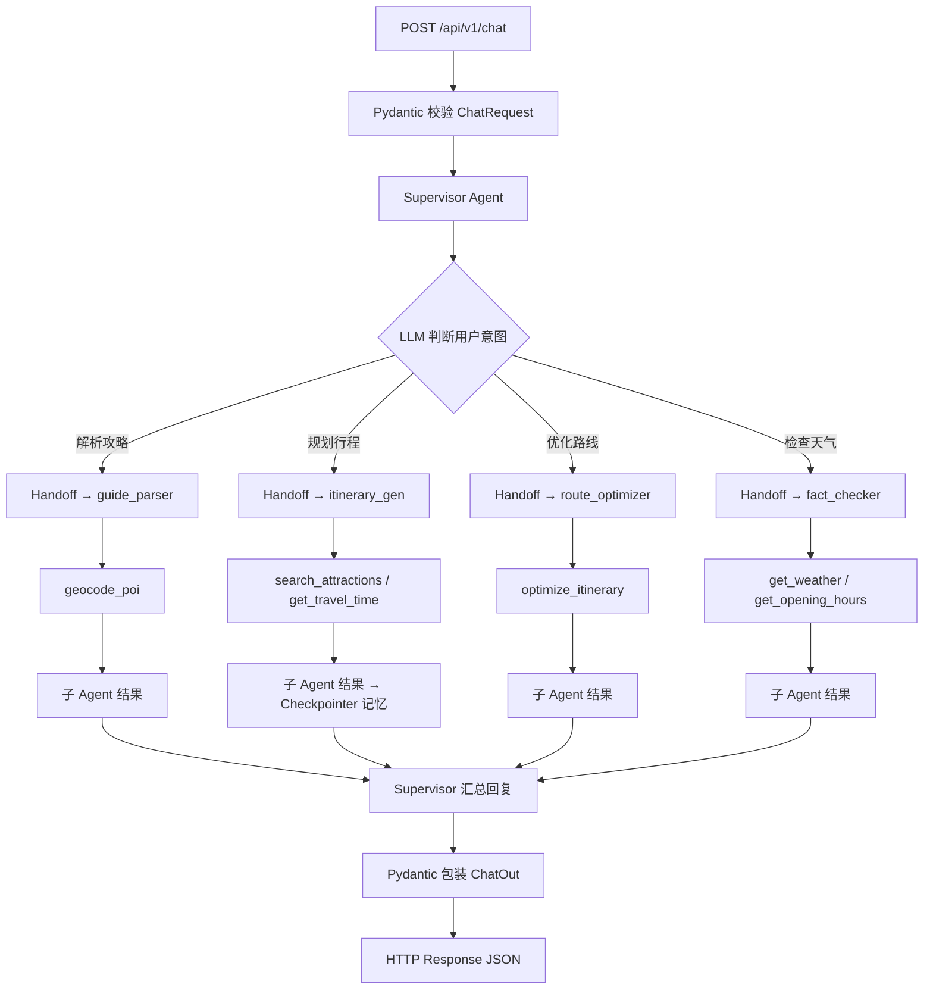

# 知识地图：AI 旅行规划助手 全栈学习笔记

> 持续生长的知识地图。随学习深入不断补充、修正、拓展。
> 最后更新：2026-05-19

---

## 目录

- [1. LangChain 基础角色](#1-langchain-基础角色)
- [2. 模型：invoke / stream、参数与初始化](#2-模型invoke--stream参数与初始化)
- [3. 消息与提示词](#3-消息与提示词谁说话怎么说)
- [4. 工具与 Agent](#4-工具tools与-agent让模型会用工具)
- [5. 命令行 vs Web 主循环](#5-命令行-vs-web谁控制主循环)
- [6. HTTP 请求基础与 FastAPI](#6-http-请求基础与-fastapi)
- [7. 工程分层](#7-工程分层shemas--services--agents--tools)
- [8. 链式 Agent 调用](#8-链式-agent-调用)
- [9. Supervisor 多 Agent 编排](#9-supervisor-多-agent-编排)

---

## 1. LangChain 基础角色

- **LangChain 定位**：智能体工程平台（不是单一库），提供模型、消息、提示词、工具、Agent 等一整套组件。
- **LangChain vs LangGraph**：
  - LangChain 偏**高层封装**，快速拼出一个 Agent（模型 + 提示词 + 工具）。
  - LangGraph 偏**底层编排**，用图的方式精细控制状态、记忆、人机协作等复杂流程。

---

## 2. 模型：invoke / stream、参数与初始化

- **模型初始化**：用统一的 chat 模型类封装不同提供商（OpenAI、DeepSeek 等），参数包括 temperature、max_tokens、stream 等。
- **invoke**：一次性拿完整结果，适合后台处理、再喂给工具/后续逻辑。
- **stream**：流式输出，一块一块返回内容，适合命令行或聊天前端，让用户"边看边出字"。
- **结论**：命令行聊天工具更适合用 stream。

---

## 3. 消息与提示词：谁说话、怎么说？

### 消息类型（Messages）— 四种角色

| 类型 | 直觉角色 |
|------|---------|
| `system` | 设定整体行为和规则 |
| `user` | 用户真正的提问 |
| `ai` / `assistant` | 模型的历史回答 |
| `tool` | 工具调用的输出，供模型后续推理 |

### 提示词（Prompts）

不只是"几句规则"，而是结构化组织和生成消息的模板系统：

- 用模板写好 system、user 等消息结构，带占位符（如 `{question}`）。
- 调用前填入变量，生成一整组 messages 再送入模型。

### 分层思维

- "设计模板 + 填占位符" → **提示词层**
- 模板填好之后的具体 messages → **消息层**

---

## 4. 工具（Tools）与 Agent：让模型"会用工具"

- **工具函数**：如 `get_current_time()`，输入简单/无，输出当前时间字符串。
- **工具封装**：给工具起 `name` 和 `description`，注册成 Tool 对象。模型通过名字与描述来"选择"工具。
- **Agent = 三要素组合**：
  - 模型（大脑）
  - 工具列表（手脚）
  - system 提示词（行为规范：何时该调用工具）

### 决策流程

```
用户消息 → [判断] → 普通聊天 → 直接回复
                  → 需要工具 → 调用 Tool → 拿到 tool message → 推理 → 生成 ai message
```

---

## 5. 命令行 vs Web：谁控制"主循环"？

| | 命令行 Demo | Web（FastAPI） |
|---|---|---|
| 主循环 | `while True` + `input()` + `print()` | 无 while，FastAPI 管理每次 HTTP 请求 |
| 调用方式 | 循环内 `agent.invoke()` | 路由函数内一次 `agent.invoke()` |
| 对话如何续 | 循环自动继续 | 前端继续发请求才继续 |

**关键认知**：`while` 是"应用控制对话主循环"，不是 LangChain 强制要求。Web 场景不需要它。

---

## 6. HTTP 请求基础与 FastAPI

### HTTP 请求结构

- **请求行**：`POST /chat HTTP/1.1`
- **头**：`Content-Type: application/json`、`Host: ...`
- **Body**：JSON 载荷

```json
{
  "user_id": "abc123",
  "message": "现在几点了？"
}
```

### FastAPI + Pydantic 协作

- `ChatRequest(BaseModel)` / `ChatResponse(BaseModel)` 声明请求/响应 JSON 结构并做校验。
- `@app.post("/chat")` 把 Python 函数暴露成 HTTP 接口。
- 自动流转：`JSON → ChatRequest 对象 → 函数逻辑 → Python dict / Pydantic → JSON 响应`

---

## 7. 工程分层：schemas / services / agents / tools

```
schemas ──→ FastAPI 路由 ──→ services ──→ agents ──→ tools
  ↑                                                    │
  └──────────── 响应包装 ←──────────────────────────────┘
```

| 层 | 职责 |
|----|------|
| **schemas** | Pydantic 定义 API 输入/输出结构，HTTP 层参数结构化与校验 |
| **FastAPI 路由** | URL → 函数映射 |
| **services** | 封装业务逻辑（调用哪个 Agent、查数据库） |
| **agents** | LangChain 组装模型 + 提示词 + 工具 + 消息，与 LLM 对话，控制多轮推理与工具调用 |
| **tools** | 调用真实世界数据源（时间、天气、数据库、RAG 检索等） |

### schemas 与 agents 的职责边界

**schemas**（对外接口层）：
> 负责把 HTTP 层的输入输出结构化和校验。定义"外面长什么样"——请求体和响应体应该有哪些字段、什么类型、必填还是可选。

**agents**（内部大脑层）：
> 负责在内部把业务意图转成一整套发给 LLM 的 messages（必要时还调用 tools），并把 LLM 的响应整理成业务能用的结果。定义"AI 怎么思考、怎么做事"——用什么提示词、有哪些工具、如何组织消息、如何从 LLM 回复中提取有效信息。

```
HTTP 请求（JSON）                   LLM 响应（AIMessage）
      │                                      │
   schemas                              agents
 （校验结构，                         （提取 JSON，
  转成对象）                           转成业务结果）
      │                                      │
      └──────→ services 业务逻辑 ←──────────┘
```

**一句话**：schemas 管"外面长什么样"，agents 管"AI 怎么干活"。两者通过 services 层衔接。

---

## 8. 链式 Agent 调用

**本质**：服务层做胶水，Agent 做黑盒处理单元。前一个 Agent 的输出 → 服务层转换 → 后一个 Agent 的输入。

### 架构模型



- Agent A 和 Agent B **互不知晓**——各自有独立的 prompt、Tool 列表、system_prompt
- 串联逻辑全在 Service 层——谁调谁、数据怎么传、错误怎么处理

### 链式调用 vs 编排模式



| | 链式调用 | 编排模式（Supervisor） |
|---|---|---|
| Agent 关系 | 互不知晓 | Agent 互相感知 |
| 控制权 | Service 层代码控制顺序 | Supervisor Agent 决策 |
| 数据传递 | Service 层传结构化数据 | Agent 间消息协议 |
| 适用场景 | 线性管道处理 | 分支 / 并行 / 回退 |
| 复杂度 | 低 | 高 |

### 三个关键决策

1. **Tool 粒度**：确定性算法（排序、计算）→ 粗粒度 Tool，LLM 只负责调用；不确定性决策（搜什么、查什么）→ 细粒度 Tool，LLM 编排
2. **是否加 Checkpointer**：多轮对话场景 → 加；一次性处理 → 不加
3. **接口稳定性**：Tool 的输入/输出是 Agent 间的"合同"，内部实现可换（如 geocode 从 mock 换到高德），接口不变则上下游不动

### 常见坑

- **上下文膨胀**：只传关键字段，别把 Agent A 的完整消息历史塞给 Agent B
- **错误传播**：Service 层做格式校验，A 输出不合法就不传给 B
- **延迟叠加**：链式 = 延迟相加，非关键阶段考虑异步

---

## 9. Supervisor 多 Agent 编排

### 是什么

Supervisor（主管 Agent）是一种**多 Agent 编排模式**：用一个"主管"Agent 管理多个"专家"子 Agent。

> **一句话：Supervisor 是一个 Agent，它的 Tool 是其他 Agent。**

这和你在第 4 节学到的 Tool Calling 完全一样——LLM 判断用户需要什么，然后"调用工具"。唯一的区别：这里的"工具"不是 Python 函数，而是另一个完整的 Agent。

### 和已有知识的关系

```
普通 Agent（Step 3 的 fact_checker）：         Supervisor Agent（Step 6）：
  LLM 判断意图                                  LLM 判断意图
    ├── 需要天气 → 调 get_weather Tool            ├── 需要解析攻略 → 调 guide_parser (handoff)
    └── 需要开放时间 → 调 get_opening_hours        ├── 需要规划行程 → 调 itinerary_gen (handoff)
                                                    ├── 需要优化路线 → 调 route_optimizer (handoff)
                                                    └── 需要检查天气 → 调 fact_checker (handoff)
```

### 核心机制：Handoff Tool（移交工具）

`langgraph-supervisor` 包提供 `create_supervisor` 函数，它为每个子 Agent **自动生成**一个 Handoff Tool。这些 Tool 的作用是**转移控制权**——当 Supervisor 调用 `transfer_to_guide_parser` 时，LangGraph 把当前对话消息传给 guide_parser 执行，执行完再交回 Supervisor。

```
用户消息 → Supervisor LLM 思考
              │
              ├── "这是攻略解析任务" → 调用 transfer_to_guide_parser
              │                              │
              │                    guide_parser 执行（调 geocode_poi Tool）
              │                              │
              │                              └── 返回结果 → 回到 Supervisor
              │
              └── Supervisor 把结果返回给用户
```

**安装**：
```powershell
pip install langgraph-supervisor
```

**关键代码结构**：
```python
from langgraph_supervisor import create_supervisor

# 每个子 Agent 必须有唯一的名字
guide_parser.name = "guide_parser"
itinerary_gen.name = "itinerary_gen"

# create_supervisor 自动为每个子 Agent 生成 handoff tool
workflow = create_supervisor(
    agents=[guide_parser, itinerary_gen, route_optimizer, fact_checker],
    model=model,
    prompt="你是旅行规划团队的主管...（描述每个 Agent 的能力和触发条件）"
)

# 编译时加 Checkpointer（聊天需要多轮记忆）
app = workflow.compile(checkpointer=PostgresSaver(conn))
```

### Supervisor vs 链式调用

| | 链式调用（Step 5） | Supervisor（Step 6） |
|---|---|---|
| **谁做决策** | 开发者写死在 Service 层 | LLM 动态判断 |
| **调用顺序** | 固定（先 A 后 B） | 按需（可能跳过、回退、并行） |
| **Agent 关系** | 互不知晓 | Supervisor 知道所有子 Agent 的能力 |
| **用户入口** | 调用不同 API 端点 | 一个 `/chat` 入口，自然语言 |
| **适合场景** | 确定性管道（生成→优化→入库） | 对话式、多分支、用户意图不确定 |
| **复杂度** | 低 | 中 |

### 服务层的角色变化

Step 6 之后，服务层**不会消失**，只是职责重新分配：

```
Step 5:  Service 层 = 指挥官 + 执行者（决定调谁 + 干活）
Step 6:  Service 层 = 执行者（干活，编排决策交给 Supervisor）
```

| 职责 | 由谁做 |
|------|--------|
| "先调谁、后调谁"的决策 | **Supervisor（AI）** |
| JSON → ORM 对象转换 | **Service 层（代码）** |
| 数据库读写 | **Service 层（代码）** |
| 时间槽计算、格式校验 | **Service 层（代码）** |

**一句话**：编排决策上移至 AI，确定性逻辑留在代码。

### 三个关键设计决策

1. **子 Agent 需要名字**：`create_supervisor` 按 Agent 的 `.name` 属性生成 Handoff Tool。不设名字 → 所有 Agent 同名 → 无法区分。
2. **Supervisor 也加 Checkpointer**：聊天本身就是多轮对话（"先帮我规划"→"再查天气"→"优化一下"），Supervisor 需要记住上下文。
3. **原有端点保留**：`POST /api/v1/chat` 是新增的统一入口，旧的 `/trips`、`/sources/parse`、`/facts/check` 仍然可用。两种入口共存，按场景选择。

### 常见坑

- **忘记设 Agent 名字**：Supervisor 无法区分子 Agent，路由混乱
- **子 Agent 的 Checkpointer 与 Supervisor 冲突**：子 Agent 有 PostgresSaver 时，handoff 后子 Agent 的 state 使用 Supervisor 的 thread_id——确保 thread_id 前缀不冲突（`chat-` vs `trip-`）
- **Supervisor 跳过子 Agent 直接回复**：prompt 里要明确要求"必须将任务交给专家处理"，否则 LLM 可能自己瞎编

---

## 链路全景

### 链式调用（Step 5）



### Supervisor 编排（Step 6）



> 链式调用 = Service 层硬编码"先 A 后 B"。Supervisor = LLM 动态决定"谁来干、怎么干"。两种模式各有用处，可共存。
