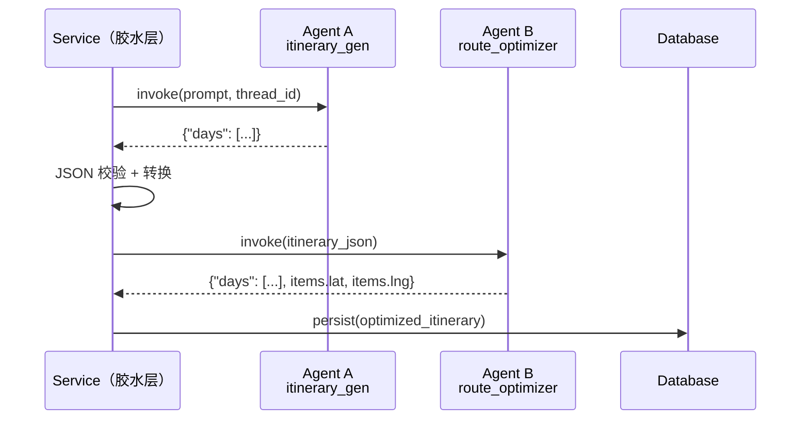
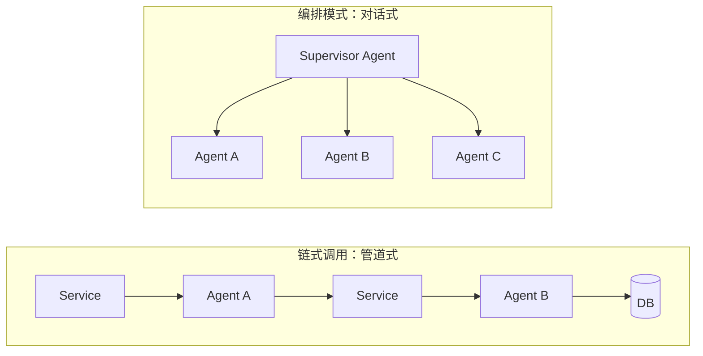
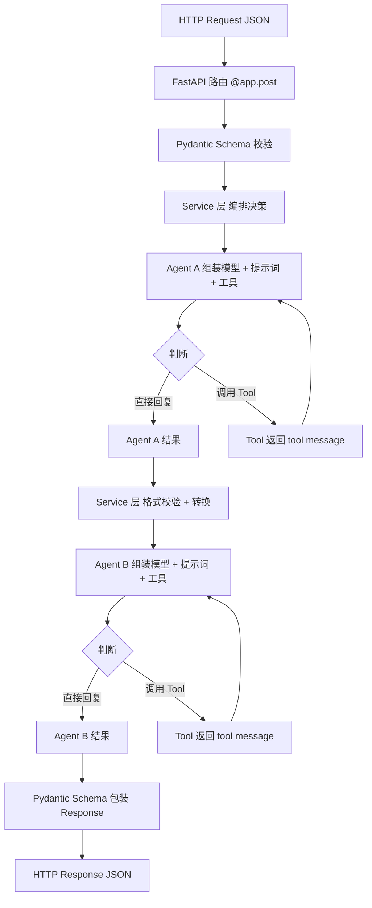
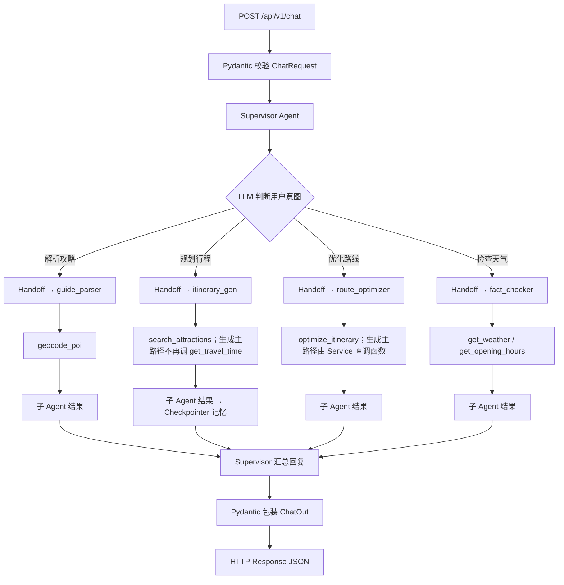

# 知识地图：AI 旅行规划助手 全栈学习笔记

> 持续生长的知识地图。随学习深入不断补充、修正、拓展。
> 最后更新：2026-09-04
>
> **完整复盘从 [§0](#0-先看这个项目现在实际怎么跑) 读起。** §1–13 是 5 月学习笔记（教学形状）；§14–16 是 9 月纠正。两套不要混成「当前架构」。
>
> 产品需求与开发路线（2026-09）：[requirements-v3.md](../specs/ai-travel-assistant/requirements-v3.md)、[technical-roadmap-v3.md](../specs/ai-travel-assistant/technical-roadmap-v3.md)。与 V1/V2 冲突时以 V3 为准。

---

## 目录

- [0. 先看这个：项目现在实际怎么跑](#0-先看这个项目现在实际怎么跑)
- [1. LangChain 基础角色](#1-langchain-基础角色)
- [2. 模型：invoke / stream、参数与初始化](#2-模型invoke--stream参数与初始化)
- [3. 消息与提示词](#3-消息与提示词谁说话怎么说)
- [4. 工具与 Agent](#4-工具tools与-agent让模型会用工具)
- [5. 命令行 vs Web 主循环](#5-命令行-vs-web谁控制主循环)
- [6. HTTP 请求基础与 FastAPI](#6-http-请求基础与-fastapi)
- [7. 工程分层](#7-工程分层shemas--services--agents--tools)
- [8. 链式 Agent 调用](#8-链式-agent-调用)
- [9. Supervisor 多 Agent 编排](#9-supervisor-多-agent-编排)
- [10. Agent 设计原则：定位、粒度与边界](#10-agent-设计原则定位粒度与边界)
- [11. 路线优化：从 mock 到真实 API 路径排序](#11-路线优化从-mock-到真实-api-路径排序)
- [12. MVP 后规划：记忆架构与外部集成](#12-mvp-后规划记忆架构与外部集成)
- [13. LLM 优势边界与设计决策树](#13-llm-优势边界与设计决策树)
- [14. 可靠异步生成：Job 才是真源](#14-可靠异步生成job-才是真源)
- [15. 一次规划：什么时候不该再开 Agent](#15-一次规划什么时候不该再开-agent)
- [16. 复盘如何变成面试题](#16-复盘如何变成面试题)

---

## 0. 先看这个：项目现在实际怎么跑

> 9 月 vibe coding 里最清楚的一次感觉：把固定步骤包成 Agent，系统会变慢、变难测、变难讲。完整调用链对照代码，不对照 5 月的学习目标。盘点见 [过度包装复盘](2026-09-04_Agent-Overwrap-Inventory.md)。

### 三种调用形态（先立标准）

仓库里凡是打了 MiniMax 的地方，只可能是下面三种之一。面试和复盘都用这张表，不要用「我们是多智能体系统」一笔带过。

| 形态 | 模型做什么 | 步骤谁决定 | 现在该用在哪 |
|------|------------|------------|--------------|
| **Workflow** | 最多一次 `model.invoke`，或不调模型 | **你写死的顺序** | 建议参数、排路、合并去重、行程聊天出 Delta、Job 状态机 |
| **单 Agent** | 自己决定调哪些 Tool、调几次 | 模型 + 工具循环 | 只有「选哪些点 / 从非结构化文本抽出什么」这种不确定步骤 |
| **Supervisor** | 再决定把话交给哪个 Agent | 模型调 Agent | 一个入口吃所有自然语言。**前端没有这个入口** |

判断句：

```
这段逻辑每次都必须发生，且顺序固定？
  → Workflow（函数 / Service / Worker）
用户一句话里，工具集合和次数事先不知道？
  → 单 Agent
用户一句话可能是完全不同的产品功能，且没有各自的页面？
  → 才需要 Supervisor
```

5 月为了学习，很多 Workflow 被做成了第三种。9 月生成变快，本质是把生成主路径从「假 Supervisor 管道」收成 Workflow。

### 前端真实有三条路

```
首页 /                         攻略 /sources                      行程 /trips/:id
  │                              │                                  │
  ├ POST /trips/suggest          ├ POST /sources                    ├ 节点增删改排
  │   一次 LLM，不是 Agent       │   存文本                         │   trip_editor，无模型
  ├ POST /trips                  ├ POST .../parse                   ├ POST .../reoptimize
  │   建 Trip + Job              │   guide_parser Agent             │   直调 optimize_itinerary
  └ 跳到行程页等 SSE             ├ 用户勾选 POI                     ├ POST .../chat/stream
                                 └ 导入已有行程                     │   一次 LLM 出 Delta
                                   或带 selected_entities 创建 Job   └ 用户点采纳 → apply_delta
                                   （fill 按勾选拼天，不再从零套娃）
```

**主路径 B（首页从零生成）——这是你测过变快的那条：**

```
浏览器
  → POST /trips/suggest          ChatOpenAI 填表（Workflow）
  → POST /trips                  写 Trip(generating) + Job(pending)
  → GET /jobs/{id}/events        SSE 通知，真源仍是 Job 行
后台 Worker
  → SKIP LOCKED 领取，run_token fencing
  → fill                         无候选则 itinerary_gen（最多搜一次）；有候选则按 day_index 拼 JSON
  → optimize_itinerary()         函数：geocode → 矩阵 → 贪心 → 回填路时
  → verify                       规则 + 天气/开放时间；失败只打 warning，Job 仍可 succeeded
  → persist_itinerary            写库
  → Job succeeded                stages: prepare → fill → route → verify → done
```

这里只有 **一个** Agent（选点排天）。排路不是 Agent。Job 不是 Agent。

**路径 A（贴攻略）——P1 已按勾选 fill：**

```
贴文本 → 存 Source → guide_parser 抽 POI → 勾选
  → 导入已有行程的候选列表
  或「根据勾选创建」：POST /trips 带 selected_entities → Job fill 跳过 itinerary_gen
```

**路径 C（行程内改）——已经是 Workflow，这是对的：**

```
聊天：一次 LLM → {reply, suggestions[]}
用户采纳 → apply_delta → 必要时 reoptimize_day（函数）
时效：POST /facts/check 存在，前端行程页未接
统一聊天：POST /api/v1/chat 存在，前端未接
```

### 五个「Agent 文件」对照现实

| 名字 | 文件 | 前端主路径用不用 | 实际形态 | 结论 |
|------|------|------------------|----------|------|
| `itinerary_gen` | `agents/itinerary_gen.py` | 用。生成 Job 里 | 单 Agent，工具只剩搜景点 | **该留**：选哪些点、怎么分天是不确定的 |
| `guide_parser` | `agents/guide_parser.py` | 用。`/sources/:id/parse` | 单 Agent；还挂了 Tavily/Firecrawl MCP | **半过度**：UI 只贴文本时，MCP 搜抓不会发生，却仍按「会搜会抓的 Agent」来包 |
| `route_optimizer` | `agents/route_optimizer.py` | **不用** | Agent 包一层「必须调用已经写好的函数」 | **教学遗留**。生成和重算都直调 `tools/route_optimizer.py` |
| `fact_checker` | `agents/fact_checker.py` | **行程页不用** | 单 Agent + 规则引擎预计算 | 生成 Job.verify 已走 Service（`fact_verify`），不 HTTP 自调用。行程聊天接核验是 P2 |
| `supervisor` | `agents/supervisor.py` | **不用** | Agent 调上面四个 | **教学遗留**。`POST /api/v1/chat`。prompt 仍写「先 itinerary_gen 再 route_optimizer Agent」——和生成主路径已经矛盾 |

另外两个 **一次 LLM、不是 Agent**：

- `POST /trips/suggest`：自然语言 → 表单字段
- `POST /trips/{id}/chat`：行程 JSON → 回复 + Delta
- `merge_candidates()`：多源 POI 语义去重
- `POST /sources/{id}/infer-trip`：攻略 → 目的地和天数

这些才是「一条标准 workflow」：代码定顺序，模型当函数用。

### 你感觉繁琐，对应的就是这些层

```
用户要的：目的地 → 一份可改行程
学习时加的：
  Supervisor（UI 没有）
    → itinerary_gen Agent
    → route_optimizer Agent（生成已绕开）
        → optimize_itinerary 函数（真正干活）
  再加 Job / SSE / Checkpointer / MCP
```

Checkpointer、Job、高德函数各自有用。繁琐来自 **中间多出来的、不参与决策的 Agent 壳**。

9 月已经拆掉生成路径上的路线 Agent 壳，P1 解开了攻略创建套娃。还没拆的：Supervisor 入口、`route_optimizer` Agent 文件、guide_parser 对「纯文本粘贴」过厚。

### 读后面章节时怎么对照

| 章节 | 把它当成 | 不要当成 |
|------|----------|----------|
| §1–7 | 组件入门 | 当前产品架构 |
| §8 链式 Agent | 5 月教学：两个黑盒怎么串 | 生成主路径（已改成函数） |
| §9 Supervisor | 5 月教学：handoff 是什么 | 首页 / 行程页的真实入口 |
| §10–13 | 原则仍然对 | 「itinerary_gen 会调 get_travel_time」等过时例子已在 §10 改正 |
| §14–15 | 9 月生产纠正 | 和 §8/§9 冲突时，以这两节和 §0 为准 |

---

## 1. LangChain 基础角色

- **LangChain 定位**：智能体工程平台（不是单一库），提供模型、消息、提示词、工具、Agent 等一整套组件。
- **LangChain vs LangGraph**：
  - LangChain 偏**高层封装**，快速拼出一个 Agent（模型 + 提示词 + 工具）。
  - LangGraph 偏**底层编排**，用图的方式精细控制状态、记忆、人机协作等复杂流程。

---

## 2. 模型：invoke / stream、参数与初始化

- **模型初始化**：用统一的 chat 模型类封装不同提供商（OpenAI、DeepSeek 等），参数包括 temperature、max_tokens、stream 等。
- **invoke**：一次性拿完整结果，适合后台处理、再喂给工具/后续逻辑。
- **stream**：流式输出，一块一块返回内容，适合命令行或聊天前端，让用户"边看边出字"。
- **结论**：命令行聊天工具更适合用 stream。

---

## 3. 消息与提示词：谁说话、怎么说？

### 消息类型（Messages）— 四种角色

| 类型 | 直觉角色 |
|------|---------|
| `system` | 设定整体行为和规则 |
| `user` | 用户真正的提问 |
| `ai` / `assistant` | 模型的历史回答 |
| `tool` | 工具调用的输出，供模型后续推理 |

### 提示词（Prompts）

不只是"几句规则"，而是结构化组织和生成消息的模板系统：

- 用模板写好 system、user 等消息结构，带占位符（如 `{question}`）。
- 调用前填入变量，生成一整组 messages 再送入模型。

### 分层思维

- "设计模板 + 填占位符" → **提示词层**
- 模板填好之后的具体 messages → **消息层**

---

## 4. 工具（Tools）与 Agent：让模型"会用工具"

- **工具函数**：如 `get_current_time()`，输入简单/无，输出当前时间字符串。
- **工具封装**：给工具起 `name` 和 `description`，注册成 Tool 对象。模型通过名字与描述来"选择"工具。
- **Agent = 三要素组合**：
  - 模型（大脑）
  - 工具列表（手脚）
  - system 提示词（行为规范：何时该调用工具）
- **Tool 内部闭环**：复杂多步骤逻辑封装在单个 Tool 内部，Agent 只看到一次调用。真实案例见 [§11](#11-路线优化从-mock-到真实-api-路径排序)（`optimize_itinerary` 内部 geocode → 矩阵构建 → 排序 → 回填，Agent 只调一次）。
- **LLM 作为语义判断器**：并非只有 Tool 才是 LLM 的用法——`merge_candidates()` 也是一个纯函数，内部调了一次 LLM 做多源 POI 去重。对外是函数，对内是 LLM 调用。适合"判断两个东西是否语义相同"这类规则很难穷举、LLM 却一眼能判断的场景。详见 [§13](#13-llm-优势边界与设计决策树)。

### 决策流程

```
用户消息 → [判断] → 普通聊天 → 直接回复
                  → 需要工具 → 调用 Tool → 拿到 tool message → 推理 → 生成 ai message
```

---

## 5. 命令行 vs Web：谁控制"主循环"？

| | 命令行 Demo | Web（FastAPI） |
|---|---|---|
| 主循环 | `while True` + `input()` + `print()` | 无 while，FastAPI 管理每次 HTTP 请求 |
| 调用方式 | 循环内 `agent.invoke()` | 路由函数内一次 `agent.invoke()` |
| 对话如何续 | 循环自动继续 | 前端继续发请求才继续 |

**关键认知**：`while` 是"应用控制对话主循环"，不是 LangChain 强制要求。Web 场景不需要它。

---

## 6. HTTP 请求基础与 FastAPI

### HTTP 请求结构

- **请求行**：`POST /chat HTTP/1.1`
- **头**：`Content-Type: application/json`、`Host: ...`
- **Body**：JSON 载荷

```json
{
  "user_id": "abc123",
  "message": "现在几点了？"
}
```

### FastAPI + Pydantic 协作

- `ChatRequest(BaseModel)` / `ChatResponse(BaseModel)` 声明请求/响应 JSON 结构并做校验。
- `@app.post("/chat")` 把 Python 函数暴露成 HTTP 接口。
- 自动流转：`JSON → ChatRequest 对象 → 函数逻辑 → Python dict / Pydantic → JSON 响应`

---

## 7. 工程分层：schemas / services / agents / tools

```
schemas ──→ FastAPI 路由 ──→ services ──→ agents ──→ tools
  ↑                                                    │
  └──────────── 响应包装 ←──────────────────────────────┘
```

| 层 | 职责 |
|----|------|
| **schemas** | Pydantic 定义 API 输入/输出结构，HTTP 层参数结构化与校验 |
| **FastAPI 路由** | URL → 函数映射 |
| **services** | 封装业务逻辑（调用哪个 Agent、查数据库） |
| **agents** | LangChain 组装模型 + 提示词 + 工具 + 消息，与 LLM 对话，控制多轮推理与工具调用 |
| **tools** | 调用真实世界数据源（时间、天气、数据库、RAG 检索等） |

### schemas 与 agents 的职责边界

**schemas**（对外接口层）：
> 负责把 HTTP 层的输入输出结构化和校验。定义"外面长什么样"——请求体和响应体应该有哪些字段、什么类型、必填还是可选。

**agents**（内部大脑层）：
> 负责在内部把业务意图转成一整套发给 LLM 的 messages（必要时还调用 tools），并把 LLM 的响应整理成业务能用的结果。定义"AI 怎么思考、怎么做事"——用什么提示词、有哪些工具、如何组织消息、如何从 LLM 回复中提取有效信息。

```
HTTP 请求（JSON）                   LLM 响应（AIMessage）
      │                                      │
   schemas                              agents
 （校验结构，                         （提取 JSON，
  转成对象）                           转成业务结果）
      │                                      │
      └──────→ services 业务逻辑 ←──────────┘
```

**一句话**：schemas 管"外面长什么样"，agents 管"AI 怎么干活"。两者通过 services 层衔接。

---

## 8. 链式 Agent 调用

**本质**：服务层做胶水，Agent 做黑盒处理单元。前一个 Agent 的输出 → 服务层转换 → 后一个 Agent 的输入。

### 架构模型



- Agent A 和 Agent B **互不知晓**——各自有独立的 prompt、Tool 列表、system_prompt
- 串联逻辑全在 Service 层——谁调谁、数据怎么传、错误怎么处理

### 链式调用 vs 编排模式



| | 链式调用 | 编排模式（Supervisor） |
|---|---|---|
| Agent 关系 | 互不知晓 | Agent 互相感知 |
| 控制权 | Service 层代码控制顺序 | Supervisor Agent 决策 |
| 数据传递 | Service 层传结构化数据 | Agent 间消息协议 |
| 适用场景 | 线性管道处理 | 分支 / 并行 / 回退 |
| 复杂度 | 低 | 高 |

### 三个关键决策

1. **Tool 粒度**：确定性算法（排序、计算）→ 粗粒度 Tool，LLM 只负责调用；不确定性决策（搜什么、查什么）→ 细粒度 Tool，LLM 编排
2. **是否加 Checkpointer**：多轮对话场景 → 加；一次性处理 → 不加
3. **接口稳定性**：Tool 的输入/输出是 Agent 间的"合同"，内部实现可换（如 geocode 从 mock 换到高德），接口不变则上下游不动

### 常见坑

- **上下文膨胀**：只传关键字段，别把 Agent A 的完整消息历史塞给 Agent B。长期解决方案见 [§12](#12-mvp-后规划记忆架构与外部集成)（上下文修剪 + 结构化状态分离）。
- **错误传播**：Service 层做格式校验，A 输出不合法就不传给 B
- **延迟叠加**：链式 = 延迟相加。2026-09 补充：生成主路径上「规划 Agent → 路线 Agent」这一跳没有意图分支，第二跳改成服务层直调函数，少付一次模型税。详见 [§15](#15-一次规划什么时候不该再开-agent)。非关键阶段仍可考虑异步。

---

## 9. Supervisor 多 Agent 编排

> **前端没有走这个入口。** 产品聊天是 `POST /trips/{id}/chat/stream`（一次 LLM 出 Delta）。本节是 Step 6 的学习记录。Supervisor 的 prompt 仍要求「规划后再调 route_optimizer Agent」，与生成主路径 [§0](#0-先看这个项目现在实际怎么跑) / [§15](#15-一次规划什么时候不该再开-agent) 不一致。

### 是什么

Supervisor（主管 Agent）是一种**多 Agent 编排模式**：用一个"主管"Agent 管理多个"专家"子 Agent。

> **一句话：Supervisor 是一个 Agent，它的 Tool 是其他 Agent。**

这和你在第 4 节学到的 Tool Calling 完全一样——LLM 判断用户需要什么，然后"调用工具"。唯一的区别：这里的"工具"不是 Python 函数，而是另一个完整的 Agent。

### 和已有知识的关系

```
普通 Agent（Step 3 的 fact_checker）：         Supervisor Agent（Step 6）：
  LLM 判断意图                                  LLM 判断意图
    ├── 需要天气 → 调 get_weather Tool            ├── 需要解析攻略 → 调 guide_parser (handoff)
    └── 需要开放时间 → 调 get_opening_hours        ├── 需要规划行程 → 调 itinerary_gen (handoff)
                                                    ├── 需要优化路线 → 调 route_optimizer (handoff)
                                                    └── 需要检查天气 → 调 fact_checker (handoff)
```

### 核心机制：Handoff Tool（移交工具）

`langgraph-supervisor` 包提供 `create_supervisor` 函数，它为每个子 Agent **自动生成**一个 Handoff Tool。这些 Tool 的作用是**转移控制权**——当 Supervisor 调用 `transfer_to_guide_parser` 时，LangGraph 把当前对话消息传给 guide_parser 执行，执行完再交回 Supervisor。

```
用户消息 → Supervisor LLM 思考
              │
              ├── "这是攻略解析任务" → 调用 transfer_to_guide_parser
              │                              │
              │                    guide_parser 执行（调 geocode_poi Tool）
              │                              │
              │                              └── 返回结果 → 回到 Supervisor
              │
              └── Supervisor 把结果返回给用户
```

**安装**：
```powershell
pip install langgraph-supervisor
```

**关键代码结构**：
```python
from langgraph_supervisor import create_supervisor

# 每个子 Agent 必须有唯一的名字
guide_parser.name = "guide_parser"
itinerary_gen.name = "itinerary_gen"

# create_supervisor 自动为每个子 Agent 生成 handoff tool
workflow = create_supervisor(
    agents=[guide_parser, itinerary_gen, route_optimizer, fact_checker],
    model=model,
    prompt="你是旅行规划团队的主管...（描述每个 Agent 的能力和触发条件）"
)

# 编译时加 Checkpointer（聊天需要多轮记忆）
app = workflow.compile(checkpointer=PostgresSaver(conn))
```

### Supervisor vs 链式调用

| | 链式调用（Step 5） | Supervisor（Step 6） |
|---|---|---|
| **谁做决策** | 开发者写死在 Service 层 | LLM 动态判断 |
| **调用顺序** | 固定（先 A 后 B） | 按需（可能跳过、回退、并行） |
| **Agent 关系** | 互不知晓 | Supervisor 知道所有子 Agent 的能力 |
| **用户入口** | 调用不同 API 端点 | 一个 `/chat` 入口，自然语言 |
| **适合场景** | 确定性管道（生成→优化→入库） | 对话式、多分支、用户意图不确定 |
| **复杂度** | 低 | 中 |

### 服务层的角色变化

Step 6 之后，服务层**不会消失**，只是职责重新分配：

```
Step 5:  Service 层 = 指挥官 + 执行者（决定调谁 + 干活）
Step 6:  Service 层 = 执行者（干活，编排决策交给 Supervisor）
```

| 职责 | 由谁做 |
|------|--------|
| "先调谁、后调谁"的决策 | **Supervisor（AI）** |
| JSON → ORM 对象转换 | **Service 层（代码）** |
| 数据库读写 | **Service 层（代码）** |
| 时间槽计算、格式校验 | **Service 层（代码）** |

**一句话**：编排决策上移至 AI，确定性逻辑留在代码。

### 三个关键设计决策

1. **子 Agent 需要名字**：`create_supervisor` 按 Agent 的 `.name` 属性生成 Handoff Tool。不设名字 → 所有 Agent 同名 → 无法区分。
2. **Supervisor 也加 Checkpointer**：聊天本身就是多轮对话（"先帮我规划"→"再查天气"→"优化一下"），Supervisor 需要记住上下文。
3. **原有端点保留**：`POST /api/v1/chat` 是新增的统一入口，旧的 `/trips`、`/sources/parse`、`/facts/check` 仍然可用。两种入口共存，按场景选择。

### 常见坑

- **忘记设 Agent 名字**：Supervisor 无法区分子 Agent，路由混乱
- **子 Agent 的 Checkpointer 与 Supervisor 冲突**：子 Agent 有 PostgresSaver 时，handoff 后子 Agent 的 state 使用 Supervisor 的 thread_id——确保 thread_id 前缀不冲突（`chat-` vs `trip-`）
- **Supervisor 跳过子 Agent 直接回复**：prompt 里要明确要求"必须将任务交给专家处理"，否则 LLM 可能自己瞎编
- **记忆膨胀**：Supervisor 的多轮对话会让消息历史持续增长，需要修剪策略。详见 [§12](#12-mvp-后规划记忆架构与外部集成)（双通道记忆架构）。

---

## 链路全景

### 链式调用（Step 5）



### Supervisor 编排（Step 6）



> 链式调用 = Service 层硬编码"先 A 后 B"。Supervisor = LLM 动态决定"谁来干、怎么干"。两种模式各有用处，可共存。
>
> **2026-09 修正（生成主路径）**：首页 `POST /trips` 不再走「itinerary_gen Agent → route_optimizer Agent」。规划 Agent 只搜景点并输出 JSON，服务层直调 `optimize_itinerary()`。聊天 / Supervisor 仍可能 handoff 到 `route_optimizer` Agent。教学上的链式调用没有作废，生成管道从「学习支架」收成了确定性函数调用。

---

## 10. Agent 设计原则：定位、粒度与边界

> 从 Step 1-7 的实践中自然浮现。不是提前设计好的，而是在不断踩坑和修正中总结出来的。

### Agent 定位：粗粒度编排者，不是细粒度执行者

从 5 个 Agent 的实际行为看规律：

| Agent | 它做什么（决策） | 它不做什么（执行） |
|-------|-----------------|-------------------|
| `itinerary_gen` | 理解偏好 → 最多搜一次景点池 → 排天 JSON | **不**查路时、**不**拼坐标、**不**写库 |
| `route_optimizer` | 聊天路径：收 JSON → 调一次 Tool | **不**逐个 geocode（Tool 内部循环）。生成主路径已不经过这个 Agent |
| `guide_parser` | 收文本 → 调一次 Tool → 返回结构化列表 | **不**逐行解析（Tool 内部完成） |
| `fact_checker` | 收行程 → 调 Tool 查天气/开放时间 | **不**自己算风险等级 |
| `supervisor` | 读用户消息 → **一次路由决策** | **不**理解业务细节 |

**规律**：每个 Agent 只做 **一件事**——理解意图、调度 Tool、整合结果。具体的循环、计算、API 调用全在 Tool 里。

### Agent = 薄编排层

Agent 的职责边界可以用一张图概括：

```
Agent 的职责边界：
  ├── ✅ 理解用户意图（"他想要杭州3日自然风光游"）
  ├── ✅ 决定调哪个 Tool（生成主路径只留 search_attractions）
  ├── ✅ 把 Tool 返回整合成业务结果（组装行程 JSON）
  └── ❌ 不做确定性计算（geocode、路时、循环处理——这些在 Tool / Service 里）
```

**一句话**：Agent 是"决策者"不是"执行者"——它决定做什么，但具体怎么做在 Tool 里。

这和架构设计中的"编排 vs 执行"分离一致：
- **编排层**（Agent / Supervisor）：选择做什么、按什么顺序做
- **执行层**（Tool / Service）：具体怎么做、怎么存

这一思想同样适用于记忆系统——[§12](#12-mvp-后规划记忆架构与外部集成) 的"记忆 vs 状态"分离：记忆存"过程"（消息历史），状态存"结论"（结构化摘要）。两者互补，避免上下文变脏。

### 开发四原则

**原则 1：确定性逻辑留在 Tool，不确定性判断交给 Agent**

| 确定性（Tool 做） | 不确定性（Agent 做） |
|------------------|--------------------|
| geocode 坐标转换 | 用户想玩什么 |
| 路径规划 API 调用 | 这个偏好需要哪些 Tool |
| POI 搜索结果解析 | 结果是否满足用户需求 |
| 循环处理所有 POI | 是否需要进一步追问 |

Tool 做"怎么做"（循环、计算、API 调用），Agent 做"做什么"（选哪个 Tool、如何解读结果）。

源自 Step 5 **决策 5**：`get_travel_time` 内部自己做 geocode + 路径规划，而不是拆成两步让 Agent 调。"能确定做的事情，就不要让 LLM 来做"。**案例**：[§11](#11-路线优化从-mock-到真实-api-路径排序) 的贪心最近邻排序——路径排序是纯计算，代码做比 LLM 做更准、更快、更便宜。

**原则 2：Tool 粒度宜粗不宜细**

`optimize_itinerary` 一次处理所有天所有 POI，而不是让 Agent 逐 POI 调 geocode。粗粒度 Tool 减少 LLM 调用次数，减少失败面。

源自 Step 5 **Tool 粒度决策**：确定性算法（排序、计算）→ 粗粒度单 Tool，Agent 只调一次；不确定性决策（搜什么、查什么）→ 细粒度 Tool，Agent 自主编排。**案例**：[§11](#11-路线优化从-mock-到真实-api-路径排序) 的 `optimize_itinerary`——一次处理所有天所有 POI（geocode → 矩阵 → 排序 → 回填），Agent 只调一次。

**原则 3：Agent 之间互不知晓（链式模式下）**

`itinerary_gen` 不知道 `route_optimizer` 的存在，反之亦然。服务层是唯一的胶水。每个 Agent 有独立的 prompt、Tool 列表、system_prompt。

好处：Agent 可独立测试、独立替换、独立升级。底层 Tool 从 mock 换到真实 API，上下游 Agent 零改动——这是好架构的价值。

**原则 4：先跑通再优化**

Step 7.3 的 `search_attractions` 用 A 方案（preference → keywords 直传），不引入 types 分类码映射。先用最简单方案验证流程，效果不好再升级。

源自 Step 7 **决策 6**：先 A 后 B。简单方案能验证流程，复杂方案需要明确的触发条件——"效果不好"就是触发条件。

**原则 5：语义判断交给 LLM，不做规则管线**

多源 POI 合并去重，第一版设计了"归一化→别名匹配→同城模糊匹配"三层规则管线——需要维护后缀表、别名表、edit distance 阈值、地理围栏。实际上"这两个 POI 是不是同一个"是语义判断，恰好是 LLM 最擅长的事。最终方案：82 行代码 + 一次 LLM 调用替代三层管线。

源自 S10 **设计转向**（2026-05-21）。核心认知：规则系统在符号空间工作，LLM 在语义空间工作。语义空间的容错性远高于符号空间。详见 [§13](#13-llm-优势边界与设计决策树) 和 [S9-S10 复盘](2026-05-21_S9-S10-Design-Pivot.md)。

**判断标准**：
```
这个任务需要判断语义吗？
  ├── 是 → LLM 做（prompt 描述规则，不要写代码规则管线）
  └── 否 → 代码做（Tool 内部闭环，一个函数搞定）
```

### 设计原则的层级关系

```
架构原则
  ├── 接口不变，底层可换    ← Tool 签名是 Agent 间的"合同"
  ├── Agent 互不知晓         ← 保证可独立替换
  └── 编排与执行分离         ← Agent 决策 / Tool 执行

实现原则
  ├── 确定性留给 Tool        ← 不让 LLM 做可以确定的事
  ├── 语义判断留给 LLM       ← 不让代码做语义匹配（不做规则管线）
  ├── Tool 粒度宜粗          ← 减少 LLM 调用次数
  └── 先简单再迭代           ← 验证可行后再升级
```

上层保证架构可维护性，下层保证实现效率和可靠性。

### 常见反模式

| 反模式 | 为什么错 | 正确做法 | 正面案例 |
|--------|---------|---------|---------|
| Agent 内部循环调 Tool | LLM 调用次数爆炸，延迟叠加 | Tool 内部做循环，Agent 只调一次 | 2026-09 生产案例：规划 Agent 循环 `get_travel_time` 导致进度停在 30%。见 [一次规划复盘](2026-09-04_One-Shot-Generation.md) |
| Agent 之间直接传消息 | 耦合，一个改动影响全局 | Service 层做胶水，Agent 互不知晓 | [§8](#8-链式-agent-调用) 链式调用模式 |
| 一开始就用 B 方案 | 引入不必要的复杂度 | 先用最简单方案跑通流程 | [§11](#11-路线优化从-mock-到真实-api-路径排序) 贪心而非最优 TSP |
| Tool 暴露中间步骤给 Agent | Agent 需要理解实现细节 | Tool 内部闭环，对外只暴露结果 | [§11](#11-路线优化从-mock-到真实-api-路径排序) geocode → 矩阵 → 排序全部封装 |
| 用规则管线做语义判断 | 维护成本高（别名表/edit distance 阈值），边界条件无法穷举，代码冗长 | LLM 一次调用判断，prompt 描述规则即可 | S10 merge：82 行 LLM 语义去重替代三层管线（[复盘](2026-05-21_S9-S10-Design-Pivot.md)） |

---

## 11. 路线优化：从 mock 到真实 API 路径排序

> 源自 Step 7.6（2026-05-20）。详见 [实现记录](2026-05-20_Step7-Tool-Upgrade-Mock-to-API.md)，技术细节见 [Post-MVP 规划附录](2026-05-20_Post-MVP-Planning.md#附录step-76-路线优化技术细节)。

### 升级前 vs 升级后

| | 升级前（Step 5） | 升级后（Step 7.6） |
|---|---|---|
| geocode | ✅ 高德 API + mock 降级 | 不变 |
| POI 排序 | ❌ 保持 Agent 原始顺序 | ✅ 贪心最近邻重排序 |
| travel_minutes | ❌ 沿用 Agent 估算值 | ✅ 真实 API 数据回填 |
| 交通方式 | ❌ 无 | ✅ 按距离自动选 walking/transit |
| 降级策略 | ❌ 无 | ✅ Haversine 距离估算 |

### 核心概念

- **贪心最近邻**（Greedy Nearest-Neighbor）：TSP 贪心算法——固定第一个 POI（Agent 选的起点），每次选最近的未访问 POI。每日 3-5 个 POI，贪心足够。路径排序是纯计算，不适合 LLM。
- **Haversine 球面距离**：用经纬度算大圆距离（米）。两种用途：① API 调用前判断步行/公交；② API 不可用时降级估算旅行时间（walking 5km/h, transit 20km/h）。
- **按距离自动选交通方式**：`< 1500m → walking`，`≥ 1500m → transit`（≈ 步行 18 分钟分界线）。高德 transit 端点自带步行段。
- **有向旅行时间矩阵**（Directed Travel Time Matrix）：N×(N-1) 矩阵，key 为 `(from_index, to_index)` 原始索引。有向（A→B ≠ B→A 公交可能不同），用索引 key（避免同名 POI 冲突），all-or-nothing 降级（任一失败 → 该日整体降级，避免真实/估算混杂）。
- **geocode_poi 新增 city 字段**：transit API 需要 city 参数。地理编码响应中原有此字段，之前丢弃了。向后兼容——已有调用方只取 `lat`/`lng`。

### 关键设计决策

| 决策 | 选择 | 原因 |
|------|------|------|
| 排序算法 | 贪心最近邻 | N 小（3-5），确定性，无随机 |
| 交通方式 | 按距离自动选 | 1.5km 符合实际出行习惯 |
| API 策略 | 完整 N×(N-1) 矩阵 | 代码清晰，all-or-nothing 降级安全 |
| 坐标调 API | 写在 route_optimizer.py | 避免重复 geocode |
| geocode 增强 | 返回新增 city | transit 强需求，数据已在响应中 |

> **知识串联**：本节是 [§4](#4-工具tools与-agent让模型会用工具)（Tool 调用 + Tool 内部闭环）、[§8](#8-链式-agent-调用)（链式编排——itinerary_gen → route_optimizer）、[§10](#10-agent-设计原则定位粒度与边界) 原则 1&2（确定性留给 Tool、粗粒度 Tool）的真实案例。贪心排序是"确定性计算交给代码"的最佳示范。

---

## 12. MVP 后规划：记忆架构与外部集成

> 源自 2026-05-20 Post-MVP 需求分析。详见 [Post-MVP 规划文档](2026-05-20_Post-MVP-Planning.md)，决策记录见 [decisions.md](../../docs/decisions.md) #14-15。

### 三个扩展方向

| 方向 | 目标 | 优先级 |
|------|------|--------|
| 记忆与状态分离 | Agent 上下文从"全量消息"升级为"消息修剪 + 结构化摘要"双通道 | 高 |
| 外部集成（MCP） | Tavily 搜索 + Firecrawl 抓取 → 用户一句话触发全流程 | 中 |
| "抄作业"增强 | guide_parser 提取更多细节（时长/费用/时段），多源合并去重 | 高/中 |

### 记忆架构：双通道模型

**当前问题**：PostgresSaver 存完整消息历史（Level 1），Agent 只能靠读历史文本推断当前状态 → 上下文越来越脏。

**核心原则**：记忆（历史对话，过程）≠ 状态（当前任务摘要，结论）。

**推荐架构**：Agent 上下文 = 短期记忆（最近 N 轮 + 旧消息 LLM 摘要）+ 结构化状态（已规划 POI / 剩余天数 / 预算，注入 system_prompt）。

**实施三步**：
1. **结构化状态注入**（立即可做）：改 `services/itinerary.py`，每次调 Agent 前从 DB 读行程状态拼入 system_prompt
2. **上下文修剪中间件**（需开发）：消息超阈值（如 20 条）时 LLM 摘要旧消息
3. **用户画像**（远期）：跨行程偏好存独立表，行程规划时自动注入

### 外部集成：MCP vs 直接 API

**原则**：确定性逻辑 → 直接 API（高德、和风），开放性探索 → MCP（Tavily 搜索、Firecrawl 抓取）。

| | 直接 API | MCP |
|---|---|---|
| 调用方 | Python 代码 | LLM 自主决定 |
| 适用 | 确定性流程（geocode→direction） | 动态决策（搜什么、抓哪个） |
| 耦合 | 与项目代码绑定 | 标准协议，可替换 |

### "抄作业"增强

| 增强点 | 实施方式 | 改动量 | 状态 |
|--------|---------|--------|------|
| 提取游玩时长/最佳时段/费用 | guide_parser prompt 增加字段要求（含推断强度约束） | 纯 prompt 改动 | ✅ S9 完成 |
| 多源合并去重 | `merge_candidates()` → LLM 语义去重，非规则管线 | +82 行，1 次 LLM 调用 | ✅ S10 完成 |
| 源归属追踪 | ItineraryItem 加 `source_id`/`source_name` 字段 | 需改 DB | S13 待开始 |
| 图片攻略解析 | 多模态 LLM 提取 | 远期，需升级 LLM | 远期 |

> S9/S10 复盘见 [2026-05-21_S9-S10-Design-Pivot.md](2026-05-21_S9-S10-Design-Pivot.md)。关键教训：S10 最初设计成规则管线（归一化→别名→同城模糊），被纠正为 LLM 语义判断——这是"语义判断留给 LLM"原则的第一次实战验证。详见 [§13](#13-llm-优势边界与设计决策树)。

> **知识串联**：本节承接 [§8](#8-链式-agent-调用)（上下文膨胀问题）、[§9](#9-supervisor-多-agent-编排)（Supervisor 的 Checkpointer 记忆膨胀）、[§10](#10-agent-设计原则定位粒度与边界)（编排与执行分离 → 记忆与状态分离）。双通道架构是"编排 vs 执行"思想在记忆系统中的自然延伸。

---

## 13. LLM 优势边界与设计决策树

> 源自 S9-S10 开发中的设计转向（2026-05-21）。详见 [S9-S10 复盘](2026-05-21_S9-S10-Design-Pivot.md)。

### 核心认知

LLM 在**语义空间**工作，规则在**符号空间**。语义空间的容错性远高于符号空间——错别字、上下文消歧、信息密度不均，LLM 一个 prompt 搞定，规则需要多道正则/字典/阈值。

**但 LLM 不是万能**：不确定性（幻觉）、延迟、成本。设计的关键是分清什么给 LLM，什么给代码。

### LLM vs 代码：优势对比

| | LLM | 代码 |
|---|---|---|
| **语义相似度** | ✅ "西湖风景区" ≈ "杭州西湖" | ❌ 需要后缀表 + 别名表 |
| **错别字容忍** | ✅ "雷锋塔" → 知道是"雷峰塔" | ❌ edit distance 阈值难调 |
| **上下文消歧** | ✅ 南京鼓楼 ≠ 北京鼓楼 | ❌ 需要地理围栏 + city 字段 |
| **信息密度不均** | ✅ "西湖" vs "杭州西湖风景区" 自动归一 | ❌ 规则无法覆盖所有变体 |
| **确定性计算** | ❌ 幻觉、不稳定 | ✅ Haversine、API 调用、DB 查询 |
| **精确匹配** | ❌ 可能过度合并 | ✅ `==` 精确可控 |
| **状态管理** | ❌ 事务、并发、缓存 | ✅ ACID、连接池 |
| **结构化转换** | ❌ 偶尔格式错误 | ✅ 确定性强 |

### 设计决策树

```
这个任务的核心是判断"意思"（语义）还是"算数字"（确定性）？

  语义判断                             确定性计算
     │                                     │
     ▼                                     ▼
  LLM 做                               代码做
  ├── prompt 描述规则                    ├── Tool 函数
  ├── 不写代码规则管线                   ├── Service 层业务逻辑
  └── 例：POI 去重、意图识别、           └── 例：geocode、Haversine、
      文本解析、情感分析                      矩阵构建、DB 读写
```

**关键判断标准**：如果你发现自己正在写一个规则表（后缀表、别名表、edit distance 阈值表、地理围栏表）来让代码"理解"自然语言——停下来，这是 LLM 该做的事。

### 两种 LLM 使用模式

| 模式 | 形式 | 适用场景 | 案例 |
|------|------|---------|------|
| **Agent Tool** | LLM 自主决定何时调用 | 用户意图驱动的动态决策 | geocode_poi、search_attractions、get_weather |
| **函数内嵌 LLM** | 业务函数内部调一次 LLM | 确定性触发、语义判断型任务 | `merge_candidates()` — 多源 POI 去重 |

函数内嵌 LLM 模式的关键特征：
- 对外是**纯函数**，调用方不感知内部用了 LLM
- 触发时机是**确定的**（如"源数量 > 1"），不是 LLM 自己决定的
- 遵循 Tool 内部闭环原则——对外只暴露结果，不暴露中间 LLM 调用

### 常见错误：规则管线替代 LLM

**症状**：为自然语言理解任务设计多层规则处理管线（归一化→模糊匹配→消歧→合并），每层都需要手工维护规则表或阈值。

**为什么错**：
1. 规则表永远不全——新增别名/变体就要改代码
2. 层间耦合——模糊匹配依赖归一化的结果，改动一处影响全局
3. 代码量膨胀——80% 的代码处理 20% 的边缘情况
4. 阈值调优无尽——edit distance 设 2 还是 3？后缀表收多少词？

**正确做法**：判断任务本质。如果是语义判断（"这两样东西是不是同一个"），直接丢给 LLM。prompt 里写清楚规则（"错别字要合并""同城才合并"），让 LLM 自己判断。

**S10 真实案例**：
- 第一版（被否决）：`merge.py` 设计了三层规则管线（归一化→别名匹配→同城模糊），预估 300+ 行
- 最终版：`merge_candidates()` 82 行 + 一次 LLM 调用，LLM 自己做语义去重

### 与已有知识的串联

- [§4](#4-工具tools与-agent让模型会用工具) — Tool 内部闭环 + LLM 作为语义判断器，两种 LLM 使用模式互补
- [§10](#10-agent-设计原则定位粒度与边界) — 原则 1（确定性留给 Tool）+ 原则 5（语义判断留给 LLM）构成完整的"谁做什么"决策框架
- [§12](#12-mvp-后规划记忆架构与外部集成) — S9/S10 是"抄作业增强"的前两步，S10 的设计转向是本章立论来源
- [S9-S10 复盘](2026-05-21_S9-S10-Design-Pivot.md) — 完整的问题发现→纠正→沉淀过程
- [2026-09-04 一次规划](2026-09-04_One-Shot-Generation.md) — 同一棵树的另一片叶子：路时是计算，生成路径不该为了「学习链式 Agent」再付一轮模型税

---

## 14. 可靠异步生成：Job 才是真源

> 源自 2026-09-03。详见 [可靠任务复盘](2026-09-03_Reliable-Generation-Jobs.md)。

Web 请求不能一边开着 HTTP 一边等 MiniMax + 高德。生成要进后台。后台如果只是「另起一个线程碰运气」，刷新、崩溃、双 Worker 都会让用户看见一个假进度。

**真源**：`generation_jobs` 行。SSE 只通知 `status_version` 变了；回查走 `GET /jobs/{id}`。

| 能力 | 做法 | 刻意不做 |
|------|------|----------|
| 状态 | 五态 + 非法转换拒绝 | 字符串随手改 status |
| 领取 | `FOR UPDATE SKIP LOCKED` | Redis 队列「显得更分布式」 |
| 作废旧尝试 | `run_token` fencing | 只靠进程内取消 |
| 卡死 | 心跳 + stale recovery + 有限退避 | 失败立刻改回 pending 打满 CPU |
| 缺数据 | `TRIP_NOT_FOUND` 终端失败 | 永远 running |

和 [§5](#5-命令行-vs-web谁控制主循环) 的关系：浏览器没有 `while True`；Worker 的循环才是生成主循环。和 [§7](#7-工程分层schemas--services--agents--tools) 的关系：生命周期在 Service，Agent 仍然不写库。

---

## 15. 一次规划：什么时候不该再开 Agent

> 源自 2026-09-04。详见 [一次规划复盘](2026-09-04_One-Shot-Generation.md)。

[§8](#8-链式-agent-调用) 的教学形状是 `itinerary_gen` Agent → `route_optimizer` Agent。生成管道每次都必须走「JSON → 补路」，没有「按用户一句话决定做不做」的分支。第二跳 Agent 只在决定调用一个函数，变成延迟。

**生成主路径（当前）**：

```
POST /trips → Job(pending)
  → Worker claim (prepare)
  → itinerary_gen：最多 search_attractions 一次，路时填 0（plan）
  → optimize_itinerary() 函数：geocode / 矩阵 / 贪心 / 回填（route）
  → persist + Job succeeded（done）
```

**决策树补丁**（接 [§13](#13-llm-优势边界与设计决策树)）：

```
这段逻辑每次都必须发生，且没有意图分支？
  ├── 是 → Service 直调函数（或粗粒度 Tool，不再包 Agent）
  └── 否 → 才配得上 Agent / Supervisor handoff
```

产品上两条入口汇入同一候选池，不是套娃。见一次规划复盘「入口 A / B」。

---

## 16. 复盘如何变成面试题

学习文档里的坑，只有写成「现象 → 误判 → 原则 → 下一问」才能带面试节奏。手法和题库见 [interview-steering.md](interview-steering.md)。

主钩子只用一个：进度条停在 30%。可靠任务是「后来还遇到」的第二问，不要开场并讲。

