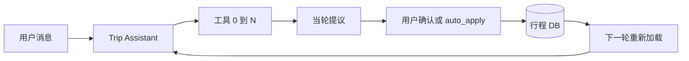

# 主线路隐患、阶段契约，以及协作侧如何用好 LangGraph

> 日期：2026-09-26 讨论。对照当日 `main` 代码，只记录决策，不在本文落地实现。  
> 配套：[CONTEXT.md](../../../CONTEXT.md)、[technical-roadmap-v3.md](technical-roadmap-v3.md)

生产生成继续走固定 Job 任务图。阶段之间用硬 Draft schema 把「能校验」做实。LangGraph（单 Agent、一轮 0/N 个工具、checkpointer）留给行程内协作。Supervisor 与 `POST /api/v1/chat` 保持学习遗留。

---

## 0. TL;DR / 决策

- 生产生成主链路（`GenerationJob`：fill → route → verify → persist）保持 Worker 里的固定任务图。不改成 LangGraph `StateGraph`，也不为生成另做一份自定义 `TypedDict` State。
- 阶段之间的可校验性来自硬 Draft schema 与边界失败，而不是把同一条链路搬进 StateGraph。
- LangGraph 用在行程内协作：`POST /trips/{id}/chat`（同步）与 `POST /trips/{id}/chat/stream`，实现为 `trip_assistant` 的单 Agent。一轮可以调用 0 个、1 个或多个工具。它不是用 Supervisor 去编排生成。
- `app/agents/supervisor.py` 与 `POST /api/v1/chat` 是学习遗留。前端行程页走的是行程聊天，不经过主管。

---

## 1. 当前主工作流（事实）

Worker 在 `src/backend/app/services/job_worker.py`。领取 Job 后 `_load_generation_input` 读行程与 Job payload（含 `selected_entities`），`thread_id` 固定为 `trip-{trip.id}`。执行期用 `run_token` 确认仍是本次领取的所有者，并打心跳（默认 30 秒）。`_default_generate` 的顺序是：

1. **fill** — `fill_itinerary_draft`（`app/services/itinerary.py`）  
   - payload 里有勾选实体：`assemble_days_from_entities`，不调用 LLM。  
   - 否则：`itinerary_gen` Agent，`invoke` 的 `thread_id` 就是上面的 `trip-{id}`。输出经 `_parse_agent_output` 从消息里截取 JSON，没有 Draft schema。
2. **route** — `route_itinerary_draft`。始终调用 Python 函数 `optimize_itinerary`（`app/agents/tools/route_optimizer.py`），不调用 `create_route_optimizer` Agent。生产默认 `respect_fill_order=True`：先按 fill 顺序计时，只在 sanity 失败时整日退回最近邻，并写 `order_source=nearest_neighbor` 与 `order_degrade_reason`。触发条件（代码常量）：顺序无效、同日跨城跳跃（`_CROSS_CITY_JUMP_M` = 250 km）、fill 路时相对最近邻基线 ≥ 1.5 倍且绝对多出 ≥ 30 分钟、或高德路段未核验达到一半。`reorder=False` 会锁定调用方顺序。
3. **verify** — `verify_itinerary_draft` / `apply_verify_to_draft`（`app/services/fact_verify.py`）。天气与开放时间在进程内调用，超时 12 秒。超时和工具异常在 verify 内部收成 `VerifyOutcome(degraded=True, warnings=…)`；Worker 再包一层 `try/except`。有 warning 时记一条 `key=warning` 的 stage（进度 95）。**Job 仍可成功。**
4. **persist** — `finalize_job_success` 在同一事务里调用 `persist_itinerary`，把终稿写成 `ItineraryDay` / `ItineraryItem`，`trip.status = "generated"`，并追加 `done` stage，文案「行程生成完成」。

进度 stage 的用户文案：fill 30（有勾选为「正在按勾选排行程...」，否则「正在规划景点...」）、route 70（「正在补路线...」）、verify 90（「正在核对开放时间/天气...」）。

跨天过远：`_annotate_cross_day_boundaries` 只在下一天写入 `day_boundary_warning`，并把同一句话追加到下一天第一站的 `travel_advice`。产品规则是告警，不自动把景点挪到另一天。阈值与同日跨城跳跃相同，都是 250 km。`day_boundary_warning`、`order_source`、`order_degrade_reason` 没有对应的日程列；落库后能留下的主要是被抄进 `travel_advice` 的那句文字。

协作侧的 thread 隔离已经写在 `trip_assistant.py` 模块说明里，并由 `trip_chat.chat_thread_id` 实现：聊天是 `trip-chat-{id}`，生成是 `trip-{id}`。每轮 `run_trip_chat` 用 `build_trip_context` 从数据库重新加载行程，放进当轮 system prompt。行程真源是库，不是 checkpoint 里的旧消息。

---

## 2. 为什么生成侧不必改成 LangGraph State

编排已经写死在 Worker 里：阶段顺序、verify 降级后仍可成功、进度 stage、`run_token` 与心跳。这些是任务图该管的事，StateGraph 不会自动变得更可校验。

若把 fill → route → verify 迁进 `StateGraph`，还要维护 `TypedDict`、reducer，以及 checkpoint 序列化，并和 `GenerationJob` 的状态、stage、重试再对一套账。两套状态并不会让「`day_index` 必须是整数」这件事成立。阶段之间缺的是硬契约：fill 的输出、route 的输入、verify 的输入各自能拒绝非法草稿，失败变成明确的 stage error 或可重试错误。

路线图的原意也是如此：Worker 不重写成 LangGraph；行程协作图与生成任务图分开（见 [technical-roadmap-v3.md](technical-roadmap-v3.md) §2、§4）。

LangGraph State 适合另一类问题：行程聊天需要一轮里动态选择 0/N 个工具、中断后恢复、以及高风险修改在落库前等人确认。那是协作（路线图 P2），不是生成主链路。

---

## 3. 直观例子：成都 3 日 · 无勾选 · LLM fill

没有 `selected_entities` 时，fill 走 `itinerary_gen`，`thread_id=trip-{id}`。模型可以返回一份看起来完整的 JSON，同时带上软缺陷。下面按当前代码说明这些缺陷会落到哪里。并不是每一种软缺陷都会让 Job 成功；字符串 `day_index` 的例外见本节末尾。

**1. Fill 交出一份像样但偏软的 JSON。** 例如：同一天市区和远郊来回折返；部分点没有 lat/lng；`day_index` 是字符串 `"1"`；同一天 `seq` 重复且不一致。`_parse_agent_output` 只要能 `json.loads` 就收下，没有边界校验。

**2. 软契约让 route 继续跑。** 默认尊重 fill 顺序。折返若没有超过「1.5 倍且多 30 分钟」，`order_source` 保持 `fill`，别扭的顺序会留下来。缺坐标不会让 stage 失败：`optimize_itinerary` 会地理编码，城市内搜索失败时 `geocode_poi` 的 mock 回退仍可能填上坐标，Job 上看不到一条「坐标未核实」的 warning。重复且不一致的 `seq` 会被当成 `invalid_order`，整天改成最近邻并打上 `order_degrade_reason`，Job 仍可成功。相邻日首尾超过 250 km 只写跨天告警，不重排天数。

**3. Verify 超时或工具失败。** 天气 / 开放时间在 12 秒预算内失败时，`verify_itinerary_draft` 返回降级 warning（「时效核对未完成，行程已按路线生成」或单点查询失败）。Worker 把摘要写成 `warning` stage。`finalize_job_success` 仍把 Job 标成 succeeded，行程状态变成 `generated`。

**4. 界面上的主状态是「已生成」。** `trip.status === "generated"` 时详情壳是 `ready`，文案来自 `tripStatus.ts` 的「已生成」。列表徽章只区分规划中 / 可重试 / 草稿，没有「已生成但降级」。详情页会把 Job stage 里 `key === "warning"` 的条目画成次级的「时效风险」条（`TripPage` + `warningStages`），它不改变 ready 壳。路线降级（`order_source`、`order_degrade_reason`、`day_boundary_warning`）不进 Job stage；跨天那句话若抄进了 `travel_advice`，只出现在节点详情的「交通」里。用户看到的主结论仍是生成完成。

**5. 想「只重排这一份」时，fill 会被再烧一次。** 中间 fill 草稿没有单独落库，Job payload 只带着创建时的 `selected_entities`。失败重试有两条，都会整段重跑 `_default_generate`：Worker 内的 `schedule_job_retry`，以及 `POST /trips/{id}/retry`（仅当 `trip.status == "generation_failed"`，否则 409）。无勾选时第二次 fill 再调 LLM，结果可以是另一份行程。生成 checkpointer 仍挂在 `trip-{id}` 上，新的一次生成会接着旧消息写，库里的行程真源与 checkpoint 历史可以分叉。协作线程 `trip-chat-{id}` 不读这条生成线程，但生成侧重跑自己会读到旧规划消息。

和下面五条计划的对应：

| 故事里发生的事 | 清单 |
|----------------|------|
| 软 JSON 穿过 fill/route，类型错误要到落库才爆 | 1. Draft schema |
| 失败重试整段重跑 LLM fill | 2. 从 route 续跑 |
| 生成线程 `trip-{id}` 跨 Job 累积；聊天已用另一前缀 | 3. thread 隔离收紧 |
| 「已生成」是主状态，路线降级不是 | 4. 降级与完成同级可见 |
| 用户可能以为聊天或 Supervisor 会静默重做整份 | 5. 入口：生产是 Job 图 |

**对照代码的一处修正。** 字符串 `day_index` 不一定「Job 仍成功」。route 里多处 `int(day_index)` 能把 `"1"` 转成整数，但 `persist_itinerary` 用 `timedelta(days=day_idx - 1)`，字符串会 `TypeError`。该异常被分成 `INTERNAL_ERROR`（不可重试），`mark_job_failed` 把行程标成 `generation_failed`，用户看到的是「行程生成失败，请检查输入后重试」，不是「草稿字段不合法、可从 route 重试」。这正是硬 schema 要提前拦住的失败，而不是 StateGraph 能顺便修好的失败。

---

## 4. 主线路优化清单

下列各项在 2026-09-26 的 `main` 上仍是计划，除非「现状」写明已经落地。本文不实现它们。

### 1. fill / route / verify 的 Draft schema（计划）

为三个阶段的草稿定义可校验结构（整数 `day_index` / `seq`、必填 `poi_name`、坐标是否允许缺失、路段分钟的类型）。边界校验失败写成明确的 stage error，或可重试的畸形输出错误（现有 `MALFORMED_MODEL_OUTPUT` 只覆盖 `ValueError`，例如 JSON 截取失败）。不要把类型错误留到 `persist_itinerary` 再变成不可重试的 `INTERNAL_ERROR`。

**现状：** 没有这层 schema。阶段之间传递普通 `dict`。

### 2. 从 route 续跑（fill 草稿已持久化）

把 fill 草稿持久化到数据库或 Job payload，使用户或 Worker 可以只重跑 route → verify → persist，避免再调用 `itinerary_gen`。成功终稿今天会写入行程表，但那是排路和核对之后的结果，不能当作「再排一次同一份 fill」。

**现状：** 续跑已落地。fill 通过 `gate_fill_draft` 后，把这份草稿写入当前 `GenerationJob.payload["fill_draft"]`（与 `selected_entities` 同一 JSONB，不另做终稿真源）。然后才 route → verify → persist。Worker 内 `schedule_job_retry` 重领同一 Job，以及 `POST /trips/{id}/retry` 复制上一份 payload 再开 Job，只要草稿还在且再次过门，就跳过 fill / `itinerary_gen`，路线阶段文案为「沿用已生成的草稿，正在补路线...」。fill 失败或门禁失败不写草稿，重试仍整段 fill。终稿仍只在 `persist_itinerary` 成功后落行程表。尚未做：用户主动丢掉草稿再重填；生成 checkpointer 清除（本节第 3 条）。

### 3. 生成与聊天的 thread 前缀；生成侧重跑时丢掉过期 checkpoint（计划，聊天侧已落地）

聊天已使用 `trip-chat-{id}`，并在每轮从库重载行程。生成仍使用 `trip-{id}`，新 Job 不会清空或跳过 `itinerary_gen` 的 PostgresSaver 历史。收紧时：新的一次生成应清除或跳过该 `trip-{id}` 上的旧消息，避免 checkpoint 里的上一份规划影响下一次 fill。勾选 fill 不经过该 Agent，这条只约束无勾选的 LLM fill。

**现状：** 前缀隔离在协作侧已实现。生成侧未做清除或跳过。

### 4. 前端把 verify / route 降级放到与「已生成」同一优先级（计划）

`ready` / 「已生成」可以保留，但路线降级和时效降级应作为同级事实出现：是否最近邻重排、为何重排、跨天过远、时效核对未完成。次级黄条只覆盖 Job 的 `warning` stage，覆盖不了未落库的 `order_source`。

**现状：** 部分。详情页在行程已生成后仍会拉取 Job，并把 `warning` stage 显示为「时效风险」。它不改变壳和状态文案。列表没有降级徽章。`order_source` 与 `day_boundary_warning` 不是行程字段。

### 5. 文档与代码入口：生产是 Job 图，Supervisor 是遗留（文档侧部分已写）

对外说明以 Job 任务图和 `POST /trips/{id}/chat` 为准。`supervisor` / `POST /api/v1/chat` 保留为学习代码时，应在入口处标明遗留，避免再被接进行程页或生成 Worker。

**现状：** [CONTEXT.md](../../../CONTEXT.md) 的「2026-09 产品形态修正」和路线图已经这样写。代码里 `create_supervisor_agent` 与 `POST /api/v1/chat` 仍在，前端未接。本文件补的是隐患与 LangGraph 边界，不改这些入口。

---

## 5. 协作侧：如何把 LangGraph 用对

两套运行时并列：

| | 生成 | 行程内协作 |
|--|------|------------|
| 运行时 | `GenerationJob` Worker，固定阶段 | `create_trip_assistant`：一个 Agent + checkpointer |
| 入口 | 创建行程 / `POST /trips/{id}/retry` | `POST /trips/{id}/chat`、`/chat/stream` |
| 线程 | `trip-{id}`（仅 LLM fill） | `trip-chat-{id}` |
| 真源 | 成功后的行程表 | 每轮从 DB 重载的行程 JSON |
| 写库 | `persist_itinerary` | `propose_*` 后由用户采纳，或 `auto_apply` 时 `apply_*` |

Checkpoint 里应该有的是对话所需的控制状态：消息、写库模式、待确认提议。行程 JSON 不是唯一真源。当前实现已经做到「每轮从库注入 system prompt」，并在提示里要求忽略历史消息中的过期行程 JSON。`write_mode`（`propose` 或 `auto_apply`）随请求传入，提议收集在当轮的 `TripChatSession.suggestions` 里返回。它们还不是自定义 State 字段，也还没有 LangGraph `interrupt`。若协作图继续加厚，优先把 `write_mode` 与 `pending_proposals` 放进可恢复状态，仍然每轮用数据库行程覆盖任何旧草稿。

工具是普通函数，由 `trip_chat.build_tools` 装上，不是嵌套的 fill → route Agent：

- `propose_delta`、`check_facts`、`parse_guide`、`propose_photo_change` 在两种写库模式下都可用。
- `apply_delta`、`apply_photo_change` 只在「授权后自动采纳」（`auto_apply`）时注册。
- 系统提示禁止规划整份新行程，也禁止调用 `itinerary_gen`、路线 Agent、Supervisor。

交互保持「提议 → 用户确认 → 再写入」。高风险修改用人确认挡住；可选的自动写库是用户打开的模式，不是默认。图中断（interrupt / resume）适合以后要把「停在提议、等人点头再继续同一条 run」做进 checkpointer 的时候。今天的等价物是：只提议模式根本不提供 `apply_*`，确认发生在下一轮 HTTP，而不是同一次 graph run 的中断。

生成侧的 Draft / Delta schema 一旦变硬，协作侧的 `propose_delta` 应复用同一套结构，避免聊天里再发明一套更软的 JSON。

协作侧明确不做的事：把 Worker 重写成 StateGraph；把「每天的行程 JSON」checkpoint 成权威副本；让行程聊天走 Supervisor；用聊天静默重跑一整份生成。

---

## 6. 刻意不做

- 不把生产生成改成 LangGraph `StateGraph` 或自定义 TypedDict State。
- 不把 Worker 的顺序、降级、心跳、`run_token` 再实现成一套 checkpoint。
- 不用 Supervisor 多 Agent 编排 fill / route / verify。
- 不把 `POST /api/v1/chat` 接进行程页或生成路径。
- 不因跨天过远自动把景点改到另一天。
- 不把 checkpoint 里的行程 JSON 当作真源。
- 不在协作 Agent 里嵌套 `itinerary_gen` 或路线 Agent，也不把聊天当成静默的全量重新生成。
- 不在本决策里实现 Draft schema、从 route 续跑或前端降级改版。落地进度以第 4 节各条「现状」为准。

---

## 7. 相关链接

- [CONTEXT.md](../../../CONTEXT.md) —「2026-09 产品形态修正（V3）」
- [technical-roadmap-v3.md](technical-roadmap-v3.md) — 生成 Job 与行程协作图
- [requirements-v3.md](requirements-v3.md) — 生成任务图与协作助手的产品口径

代码：

- `src/backend/app/services/job_worker.py` — `_default_generate`、心跳、错误分类
- `src/backend/app/services/itinerary.py` — `assemble_days_from_entities`、`fill_itinerary_draft`、`route_itinerary_draft`
- `src/backend/app/services/fact_verify.py` — `verify_itinerary_draft`、`apply_verify_to_draft`
- `src/backend/app/services/itinerary_persistence.py` — 终稿落库，`status=generated`
- `src/backend/app/services/generation_jobs.py` — `finalize_job_success`、`schedule_job_retry`、`mark_job_failed`
- `src/backend/app/agents/tools/route_optimizer.py` — `optimize_itinerary`（生产排路函数）
- `src/backend/app/agents/itinerary_gen.py` — 无勾选时的规划 Agent 与生成 checkpointer
- `src/backend/app/agents/trip_assistant.py` — 协作 Agent，`trip-chat-{id}`
- `src/backend/app/services/trip_chat.py` — 工具、`write_mode`、每轮从库加载
- `src/backend/app/api/v1/trips.py` — `POST /trips/{id}/chat`、`/chat/stream`、`/retry`
- `src/backend/app/agents/supervisor.py`、`src/backend/app/api/v1/chat.py` — 学习遗留
- `src/frontend/src/lib/tripStatus.ts`、`src/frontend/src/lib/generationJob.ts`、`src/frontend/src/pages/TripPage.tsx` — 「已生成」与 warning stage
