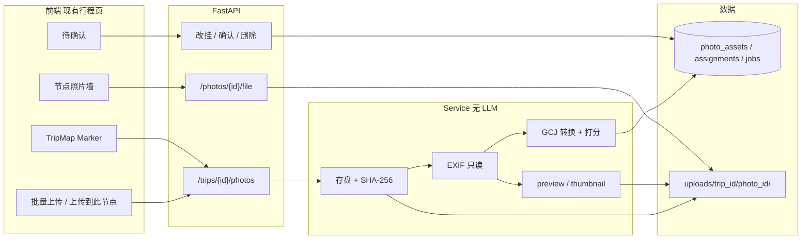
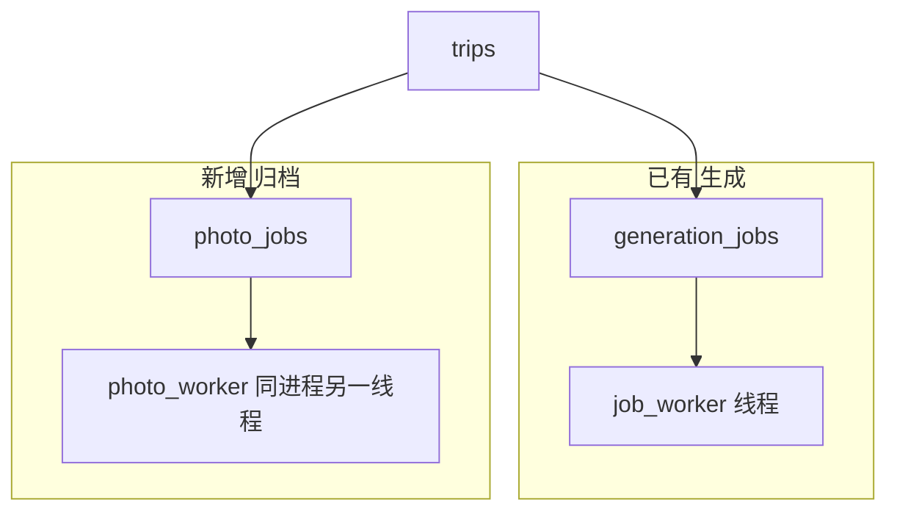
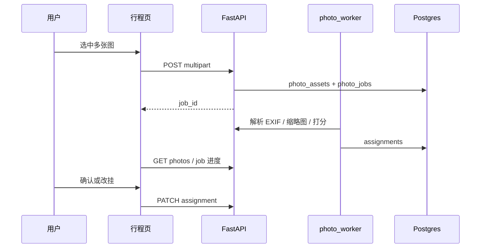
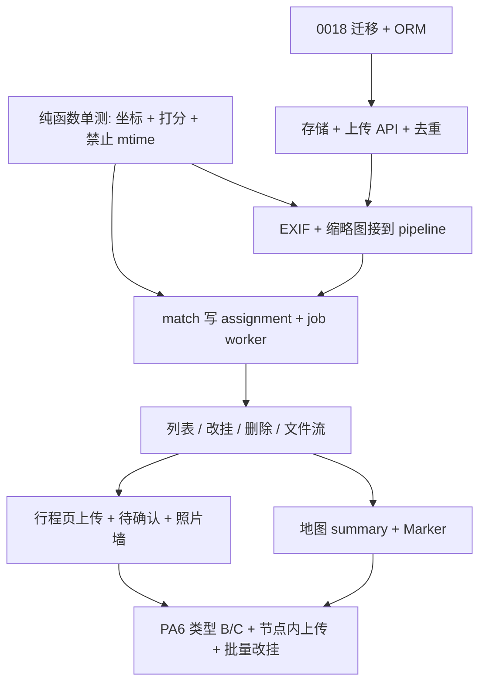

# 旅行照片智能归档：技术实现方案（MVP）

> 日期：2026-09-11  
> 分支：`feature/photo-archive`  
> 状态：**已按确认的 6 条落地（PA1–PA6）**  
>  
> 产品口径：[MVP 产品需求文档](../MVP-产品需求文档%20-%20旅行照片智能归档.md)  
> 实现进度与测试记录：[photo-archive-journal.md](photo-archive-journal.md)  
> 愿景（本期不做）：人物 YOLO  
> 下一刀（文档已冻结、代码未做）：[计划与回忆-执行计划.md](../计划与回忆-执行计划.md) — 确认后的实际到访，不覆盖计划

本文回答：在**当前仓库**里怎么把 MVP 做出来。不是从零选一套新栈。

---

## 1. 资料理解（结论）

MVP 只做一件事：旅行结束后，把照片挂到**已经规划好的** `itinerary_items` 上。

三不做：不生成行程、不排路、**不静默**往计划里加点。计划外停留是下一刀 `visit_stops`，须用户确认。

三类照片：

| 类 | 元数据 | 处理 |
|----|--------|------|
| A | 有 GPS | WGS-84→GCJ-02 后打分；≥0.85 自动挂 |
| B | 无 GPS、有 EXIF 时间 | 当天节点候选，不自动挂 |
| C | 微信等下载图，两者都没有 | 待确认；**禁止**用文件/下载时间当 `captured_at`；可从节点「上传到这里」视为手动指定 |

本期 **不调用 LLM / YOLO / 多模态**。地点匹配是 Python 计算。

现有可复用：行程节点 `lat/lng`（高德 GCJ-02）、`date`/`start_time`/`end_time`、`TripMap` Marker、生成 Job 的「库内状态 + 进程内 Worker」形态（**另开 `photo_jobs` 表**）。

---

## 2. 能力盘点：要什么、不要什么

| 层 | 需要 | 本期不要 |
|----|------|----------|
| 前端 | 行程页上传、进度、待确认、节点照片墙、灯箱、地图 Marker 缩略图、改挂 | 新路由站点、登录页、独立相册 App |
| 后端 | multipart 上传、EXIF、缩略图、打分、改挂、删文件、按 trip 鉴权（UUID） | Celery、Redis、MinIO、LangGraph 照片图 |
| 数据库 | 三张新表 + 文件落本地盘 | 人物表、向量表 |
| AI | **无** | MiniMax 看图、自定义 YOLO |
| 第三方 | 无新 key。匹配不调高德（节点已有坐标） | 对象存储。计划外簇的逆地理是 PC2，不在 MVP 匹配路径里 |

高德只出现在「节点当初是怎么定位的」（已有）。照片 GPS 用本地公式转 GCJ-02，不请求高德。

---

## 3. 技术栈（新手 / MVP）

**全部沿用现有项目，只加两个小库。**

| 用途 | 选择 | 原因 |
|------|------|------|
| API | 现有 FastAPI | 已有路由、依赖注入、`get_db` |
| 前端 | 现有 React + Vite + TS + TanStack Query | 行程页已是宿主；加区域即可 |
| 地图 | 现有 `TripMap` + 高德 JS | 关卡顺序 = 行程 `seq`；实际到访层见执行计划 PC3，不在 MVP 本文 |
| 数据库 | PostgreSQL 16 + Alembic | 与 Trip 级联删除；下一号迁移 `0018` |
| 原图存储 | 本地 `src/backend/uploads/`（已 gitignore） | 演示够用；路径存在表里，以后换 S3 只改存储层 |
| 读 EXIF | `pillow` + `piexif` | 新手资料多；只读 GPS/`DateTimeOriginal`，不写回原图 |
| 缩略图 | Pillow | 同一依赖；JPEG/WebP 预览 |
| 坐标转换 | **自写** `wgs84_to_gcj02`（约几十行） | 避免冷门包；必须单测已知点对 |
| 批处理 | 抄 `job_worker`：同进程线程 + `photo_jobs` | PRD 禁止 Redis/Celery；50 张又不能堵死一次 HTTP |
| 测试 | pytest unit + 少量 httpx；前端 `tsc` | 打分/坐标/「不填 mtime」必须无图也能测 |

**明确不加：** Next.js、Django、Mongo、PyTorch、Ultralytics、LangGraph PhotoGraph、MinIO。

HEIC：微信导出多为 JPEG。MVP 只收 `image/jpeg`、`image/png`、`image/webp`。HEIC 返回 415，提示先转 JPEG。Windows 上解 HEIC 会拖进额外依赖。

---

## 4. 系统架构



和生成 Job 的关系：



两套任务表互不抢「每行程一个进行中生成任务」的唯一约束。

上传时序（类型 A 自动挂 / B·C 待确认）：



从节点「上传到这里」：请求带 `item_id`，跳过打分，`assignment_type=manual`，`is_confirmed=true`。

---

## 5. 核心模块

| 模块 | 建议路径 | 职责 | 禁止 |
|------|----------|------|------|
| 模型 | `app/models/photo.py` | 三张表 ORM | 写进 `trip.py` 撑爆 |
| Schema | `app/schemas/photo.py` | 请求/响应 | 把二进制放进 JSON |
| 存储 | `app/services/photo_storage.py` | 落盘、读盘、删盘、哈希 | 把路径拼进前端绝对盘符 |
| EXIF | `app/services/photo_exif.py` | 只从 EXIF 取 GPS/时间；没有就 `None` | 用 `stat.mtime`、`mmexport` |
| 坐标 | `app/services/geo_convert.py` | WGS-84→GCJ-02 | 在前端再转一次 |
| 打分 | `app/services/photo_match.py` | 三类分流 + 分数 + 候选列表 | `ChatOpenAI` |
| 流水线 | `app/services/photo_pipeline.py` | 一张图：exif→thumb→match→写 assignment | 编排 Agent |
| Job | `app/services/photo_jobs.py` + 线程 | 批次进度、失败记在单张 `status` | 复用 `generation_jobs` |
| HTTP | `app/api/v1/photos.py` | 见第 8 节 | 在路由里算 Haversine |
| 静态读 | 同上 `GET .../file` | 按 `trip_id` 校验后再流式返回 | `StaticFiles` 暴露整个 uploads |
| 前端 | `PhotoPanel`、`PendingList`、`ItemPhotoStrip` | 上传与确认 | 新页面路由（可内嵌详情） |
| 地图 | 改 `TripMap` popup | 缩略图 URL + 张数 | MVP 不画第二套钉；实际到访层见执行计划 PC3 |

打分默认权重（改阈值必须改测试和 journal §3.1）：

```
Score = 0.50 * GPSScore + 0.30 * TimeScore + 0.20 * ItineraryScore
GPSScore：距离 0m→1，≥2000m→0（线性）
TimeScore：落在 [start,end] 内→1；每偏 1 小时减 0.15，下限 0；无 captured_at→0
ItineraryScore：拍摄日 == 节点日→1，否则 0（无日期则 0）
```

阈值：≥0.85 自动挂且 `is_confirmed=false`（可撤销）；0.60–0.85 挂上但待确认；&lt;0.60 不写 `item_id`。类型 B/C 强制走待确认（C 的 GPSScore=TimeScore=0）。

同批邻图（可选，PA6）：类型 C 把同 job 里已自动挂的节点当作候选，confidence 封顶 0.55，`assignment_type` 仍先用 `time` 不合适——用 `batch_neighbor`。若怕字段膨胀，第一期可只做「按天改挂」，邻图提示标为可选。

---

## 6. 数据库表结构

迁移：`0018_photo_archive.py`。`ON DELETE CASCADE`：删行程则删照片行；删节点则 `item_id` **SET NULL**（照片资产还在，变成待确认），不要 cascade 删原图。

### `photo_assets`

| 列 | 类型 | 约束 |
|----|------|------|
| id | UUID PK | 默认 uuid4 |
| trip_id | UUID FK → trips.id | ON DELETE CASCADE，index |
| file_path | Text | 相对 uploads 的原图 |
| preview_path | Text | nullable |
| thumbnail_path | Text | nullable |
| original_filename | String(512) | |
| file_hash | String(64) | SHA-256 hex |
| captured_at | DateTime | **naive，无 tz**；仅 EXIF；nullable |
| latitude | Float | EXIF WGS-84；nullable |
| longitude | Float | 同上 |
| exif_json | JSONB | nullable |
| width / height | Integer | nullable |
| status | String(32) | pending / processing / completed / failed |
| error | Text | nullable，单张失败原因 |
| created_at | timestamptz | now() |

唯一：`(trip_id, file_hash)` — 同一行程不存第二份原图。

磁盘约定：`uploads/{trip_id}/{photo_id}/original.jpg`（及 `preview.webp`、`thumbnail.webp`）。

### `photo_assignments`

| 列 | 类型 | 约束 |
|----|------|------|
| id | UUID PK | |
| photo_id | UUID FK → photo_assets | ON DELETE CASCADE |
| item_id | UUID FK → itinerary_items | ON DELETE SET NULL，nullable |
| assignment_type | String(32) | gps / time / manual / batch_neighbor |
| confidence | Float | 0–1 |
| evidence_json | JSONB | 距离、时差、候选列表、photo_class |
| is_confirmed | Boolean | default false |
| is_primary | Boolean | default true |
| created_at | timestamptz | |

部分唯一索引：每个 `photo_id` 最多一行 `is_primary = true`。  
待确认且未选节点：一行，`item_id` 空，候选在 `evidence_json.candidates`。

### `photo_jobs`

| 列 | 类型 | 约束 |
|----|------|------|
| id | UUID PK | |
| trip_id | UUID FK | ON DELETE CASCADE |
| status | String(32) | pending / running / succeeded / failed |
| progress | Integer | 0–100 |
| payload | JSONB | `{ "photo_ids": [...], "target_item_id": null \| uuid }` |
| stages | JSONB | 可选，抄生成任务文案 |
| error | Text | nullable |
| created_at / updated_at | timestamptz | |

不做「每行程只能一个进行中 photo job」的强唯一（用户可能连点两次上传）。用 job id 查进度即可。

本期 **不建** `person_*`。

---

## 7. 接口列表

均挂 `/api/v1`。无登录：能猜到 `trip_id` 即能操作（与现网行程一致）。文件接口必须校验 photo 属于该行程。

| 方法 | 路径 | 作用 |
|------|------|------|
| POST | `/trips/{trip_id}/photos` | multipart 字段 `files`（多文件）；可选表单 `item_id`（上传到此节点）。创建 assets+job，202 返回 `{ job_id, photos: [{id, duplicate}] }`。哈希重复：不写新文件，返回已有 id + `duplicate: true` |
| GET | `/trips/{trip_id}/photos` | 查询：`item_id`、`review=pending\|all`。列表含缩略图 URL、主 assignment、candidates |
| GET | `/trips/{trip_id}/photos/map-summary` | 每节点 `{ item_id, count, thumbnail_photo_id }`，供 Marker |
| GET | `/trips/{trip_id}/photo-jobs/{job_id}` | 进度；可轮询，SSE 第二期再抄 generation |
| GET | `/trips/{trip_id}/photos/{photo_id}/file` | `?variant=original\|preview\|thumbnail`，`image/*` 流 |
| PATCH | `/trips/{trip_id}/photos/{photo_id}/assignment` | `{ "item_id": uuid\|null, "action": "confirm"\|"reassign"\|"unassign" }` → manual |
| POST | `/trips/{trip_id}/photos/batch-assign` | `{ "photo_ids": [], "item_id": uuid }` 按天批量改挂 |
| DELETE | `/trips/{trip_id}/photos/{photo_id}` | 删库行 + 磁盘目录 |

MVP 进度：**先 GET 轮询 job**（2s），不先做 SSE，减少和生成任务抢同一套事件代码。50 张 &lt; 2 分钟的验收用 worker 线程即可。

前端 `api` 现只发 JSON。另加 `uploadForm(url, FormData)`，不要设 `Content-Type: application/json`。

单张上限 12MB，单次最多 50 个文件；超出 413。

---

## 8. 开发步骤与依赖



| 任务 | 对应 PA | 依赖 | 可并行 | 完成标准 |
|------|---------|------|--------|----------|
| T0 坐标转换 + 打分纯函数 | PA2/PA3 提前 | 无 | 与 T1 **并行** | pytest：已知点对；近距白天高分；凌晨低分；无 EXIF 不填时间 |
| T1 迁移与模型 | PA1 | 无 | 与 T0 并行 | `alembic upgrade` 三表存在 |
| T2 上传落盘与去重 | PA1 | T1 | | POST 一张 JPEG 有行有文件；同 hash 不复制 |
| T3 EXIF + 缩略图 | PA2 | T2、T0 | | 带 GPS 夹具读出 WGS-84；无 EXIF 则 captured_at 空 |
| T4 pipeline + photo_worker | PA3–PA4 | T3 | | 类型 A 合成数据自动挂；job 进度到 100 |
| T5 查询/改挂/文件 GET | PA5 后端 | T4 | 与 T6 设计稿可重叠 | PATCH 改 item_id；GET file 200 |
| T6 行程页 UI | PA5 | T5 | 与 T7 **并行** | 浏览器：上传→墙/待确认→改挂 |
| T7 地图缩略图 | PA5 | T5 | 与 T6 并行 | Marker 有图和张数 |
| T8 微信类与「上传到此节点」 | PA6 | T6 | | 无 EXIF 进待确认；带 item_id 的上传为 manual |

建议落地顺序：**T0+T1 一起开** → T2 → T3 → T4 → T5 → T6 与 T7 并行 → T8。  
每完成一块：跑测试 → 更新 journal 第 4/5/6/7/10 节 → 再提交。

前端可在 T5 契约稳定后开始，不必等地图。

---

## 9. 测试策略（和 PRD 对齐）

自动化（无真机旅行照）：

- `test_geo_convert.py`：WGS-84→GCJ-02 与公开样例点误差在合理范围  
- `test_photo_match.py`：三类分流与阈值  
- `test_photo_exif.py`：无 EXIF 字节不写 `captured_at`  
- `test_photo_upload.py`：去重、item_id 手动挂  

禁止：CI 里断言「10 张真机 8 张挂对」。

演示：有 GPS 的原图一批；微信另存一批。人工看待确认和地图。

---

## 10. 风险与第一期故意留白

| 风险 | 处理 |
|------|------|
| 坐标系 | 表存 WGS-84，只在 match 转 GCJ-02 |
| 微信无元数据 | 人控入口，不猜 |
| 上传超时 | job + 同进程 worker，接口先 202 |
| 磁盘撑满 | 演示可接受；单张 12MB × 50 |
| 匿名 trip_id 泄露 | 与现网行程相同；文件不目录列表 |
| 节点被删 | assignment.item_id 置空，回到待确认 |

留白：SSE、S3、视觉、人物表、对话改挂、HEIC。

---

## 11. 已确认（2026-09-11）

已按下列条目开发：

1. **不引入新框架**；只加 Pillow、piexif。  
2. **有 `photo_jobs` + 同进程线程**，但不用 Redis/Celery；上传接口 202 + 轮询。  
3. **不调 LLM。**  
4. **HEIC 拒收。**  
5. **删行程节点不删原图**，只断开挂载。  
6. **开发顺序 T0∥T1 → … → T6∥T7 → T8。**
