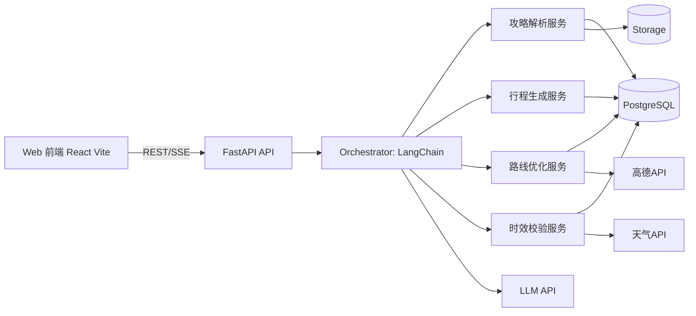
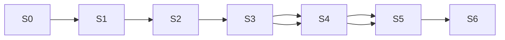

# AI 旅行规划助手 MVP 技术实现方案（基于当前 PRD）

> 说明：本文件仅为技术方案设计，不包含代码实现。

## 0. PRD 对齐结论

产品定位：**可信可改的“抄作业型 AI 行程编辑器”**。  
MVP 聚焦单用户闭环：

1. 导入攻略（链接/图片/文字）
2. 结构化解析
3. 生成可执行行程
4. 节点可编辑并重算路线
5. 展示信息时效性与风险提示

MVP 不做：多人协作、订票下单、社区/UGC。

---

## 1. 能力需求分析（前端 / 后端 / 数据库 / AI / 第三方）

| 领域 | 必要能力 |
|---|---|
| 前端 | 对话输入、攻略导入、行程编辑器（天-时段-地点）、地图路线展示、时效/风险标签、任务进度状态 |
| 后端 | 攻略解析管线、行程生成编排、路线优化、时效校验、任务异步处理、统一 API |
| 数据库 | 行程主数据、行程节点版本、解析来源追踪、时效检查记录、任务状态 |
| AI 能力 | 文本/图片/链接内容抽取、结构化信息提取、行程草案生成、解释与置信度输出 |
| 第三方服务 | 地图与路径（高德）、天气（和风/Open-Meteo）、LLM（通义/DeepSeek/OpenAI 兼容）、对象存储（Supabase Storage） |

---

## 2. 新手 + MVP 推荐技术栈（含理由）

| 层 | 推荐 | 原因 |
|---|---|---|
| 前端 | React (Vite) + TypeScript + Tailwind + shadcn/ui + react-router-dom | 纯 SPA，无 SSR 心智负担；Vite 构建快、HMR 极速；与独立 FastAPI 后端天然分离 |
| 状态管理 | TanStack Query + Zustand | 服务端状态与本地编辑状态分离清晰，心智负担小 |
| 后端 | FastAPI + Pydantic | Python 生态适配 LangChain，接口定义清晰，开发效率高 |
| AI 编排 | LangChain（先 LCEL，暂不引入复杂多 Agent） | 符合当前学习目标，先做稳定链路再升级 |
| 数据库 | Supabase PostgreSQL | 托管省运维，Postgres 关系建模适合行程与版本管理 |
| 存储 | Supabase Storage | 图片/导入原文可直接存，减少自建对象存储成本 |
| 地图服务 | 高德 Web/REST API | 中文场景与国内路径规划适配较好 |
| 天气服务 | 和风天气（优先） | 国内稳定、时效信息完整 |
| LLM | 通义千问或 DeepSeek（OpenAI 兼容接入） | 中文表现与成本对 MVP 友好 |
| 部署 | Vercel/Cloudflare Pages（前端静态）+ Render/Railway（后端） | 纯 React SPA 可部署到任意静态托管，Vercel 仍是最简选择 |

---

## 3. 系统架构设计

---

## 4. 核心模块设计

1. **输入与任务模块**：接收文本/链接/图片，创建 `planning_job` 异步任务。  
2. **攻略解析模块**：抽取地点、时间、预算、交通偏好，输出结构化候选点与置信度。  
3. **行程生成模块**：按约束生成“天-时段-地点”初稿。  
4. **路线优化模块**：基于高德距离/耗时做顺序优化，减少折返。  
5. **节点编辑模块**：用户改单点后触发局部重算（保留已锁定节点）。  
6. **时效与可信模块**：对天气/开放时间/交通做更新时间标注和过期风险提示。  
7. **可执行性评分模块**：输出通勤占比、日程拥挤度、冲突检测结果。  
8. **版本快照模块**：每次重算生成版本，可回滚与对比。

---

## 5. 数据库表结构（MVP）

| 表名 | 关键字段（示例） | 说明 |
|---|---|---|
| `users` | `id`, `name`, `created_at` | 用户（可先匿名） |
| `trips` | `id`, `user_id`, `destination`, `start_date`, `end_date`, `people_count`, `budget_min/max`, `status` | 行程主表 |
| `trip_constraints` | `trip_id`, `preferences_json`, `must_visit_json`, `avoid_json` | 约束条件 |
| `source_documents` | `id`, `trip_id`, `type(link/image/text)`, `content_ref`, `parse_status`, `confidence` | 导入来源 |
| `source_entities` | `id`, `source_id`, `entity_type`, `name`, `city`, `time_hint`, `lat`, `lng`, `confidence` | 解析出的结构化实体 |
| `itinerary_days` | `id`, `trip_id`, `day_index`, `date` | 天维度 |
| `itinerary_items` | `id`, `day_id`, `seq`, `poi_name`, `start_time`, `end_time`, `lat`, `lng`, `transport_mode`, `travel_minutes`, `cost_estimate`, `is_locked` | 行程节点（可编辑） |
| `route_snapshots` | `id`, `trip_id`, `version`, `reason`, `metrics_json`, `itinerary_json` | 版本与重算快照 |
| `fact_checks` | `id`, `trip_id/item_id`, `fact_type`, `value`, `source`, `last_verified_at`, `expires_at`, `risk_level` | 时效与可信记录 |
| `planning_jobs` | `id`, `trip_id`, `job_type`, `status`, `progress`, `input_json`, `output_json`, `error_message` | 异步任务状态 |

---

## 6. 接口列表（MVP）

| 方法 | 路径 | 说明 |
|---|---|---|
| `POST` | `/api/v1/trips` | 创建行程（基础信息） |
| `POST` | `/api/v1/trips/{tripId}/sources` | 上传链接/图片/文本攻略 |
| `POST` | `/api/v1/trips/{tripId}/parse` | 触发攻略解析任务 |
| `GET` | `/api/v1/jobs/{jobId}` | 查询任务进度/结果 |
| `POST` | `/api/v1/trips/{tripId}/generate` | 生成初版行程 |
| `GET` | `/api/v1/trips/{tripId}` | 获取完整行程详情 |
| `PATCH` | `/api/v1/itinerary-items/{itemId}` | 编辑单个行程节点 |
| `POST` | `/api/v1/trips/{tripId}/reoptimize` | 编辑后局部/全局重算 |
| `GET` | `/api/v1/trips/{tripId}/feasibility` | 获取可执行性评分与冲突 |
| `POST` | `/api/v1/trips/{tripId}/fact-check` | 刷新时效信息（天气/开放时间等） |
| `GET` | `/api/v1/trips/{tripId}/snapshots` | 查看版本历史 |
| `POST` | `/api/v1/trips/{tripId}/snapshots/{version}/restore` | 回滚到指定版本 |

---

## 7. 开发步骤（含并行与依赖）

### 7.1 阶段执行规则

1. 每个阶段只做一类目标，避免一开始引入复杂架构。
2. 每个阶段完成后，必须先运行该阶段对应的测试/冒烟验证。
3. 验证通过后，暂停进入下一阶段，等待你确认。
4. 只有在你确认后，才继续推进后续阶段。
5. 如果某一阶段无法独立验证，说明阶段拆分需要调整，不能直接往下做。

| 阶段 | 任务 | 并行 | 依赖 |
|---|---|---|---|
| S0 | 基线搭建：前后端脚手架、DB 迁移、健康检查、测试脚手架 | 前端脚手架、后端脚手架、DB 迁移可并行 | 无 |
| S1 | 最小可用闭环：手动输入 -> 生成行程 -> 展示结果 | 后端生成接口与前端结果页可并行 | S0 |
| S2 | 行程节点可编辑：单点修改、保存、版本快照 | 前端编辑器与后端更新接口可并行 | S1 |
| S3 | 攻略导入与解析：文本/链接优先，图片后置 | 解析管线与导入 UI 可并行 | S2 |
| S4 | 路线优化与地图导览：减少折返、展示路径 | 前端地图组件与后端优化逻辑可并行 | S3 |
| S5 | 时效与风险提示：来源、更新时间、过期提醒 | 时效规则与前端标签展示可并行 | S4 |
| S6 | 稳定化与演示发布：回归测试、异常兜底、部署 | 部署与文档、回归修复可并行 | S5 |

依赖关系图：

---

## 8. 简历导向 MVP 里程碑

1. 里程碑 A：完成“手动输入 -> 生成行程 -> 展示结果”。  
2. 里程碑 B：完成“节点可编辑 -> 保存 -> 版本快照”。  
3. 里程碑 C：完成“导入攻略 -> 解析 -> 路线优化 -> 时效提示”。  

---

## 9. 进入开发前确认点

在开始编码前，需要先确认本方案内容无误；  
后续每个阶段都采用“实现 -> 测试 -> 结果提交 -> 等你确认”的节奏推进。

---

## 10. 文档与代码一致性要求

为确保需求分析、方案设计、开发步骤、测试结果长期可追踪，新增同步文档：

- `implementation-journal.md`（同目录）

每次代码变更后，必须同步更新该文档中的：

1. 已完成功能
2. 测试结果
3. 未完成项与后续计划
4. 变更记录（日期/阶段/摘要/测试/提交号）

---

## 11. 规格文件生命周期约定

本目录（`scr/.ad/specs/ai-travel-assistant/`）的文档生命周期按以下规则执行：

1. `requirements.md`：需求与范围基线，长期保留，按范围变化更新。  
2. `research.md`：竞品研究基线，市场变化时更新，MVP 后可归档。  
3. `technical-solution.md`：技术设计主文档，架构/接口变化时更新。  
4. `implementation-journal.md`：执行日志主文档，每次代码变更后必须更新。  
5. `design.md` / `tasks.md`：按 bootstrap 标准预留；若启用则纳入同样的“变更即同步”规则。

逐文件创建/更新/冻结细则，以 `implementation-journal.md` 的“文件生命周期矩阵”为准。
